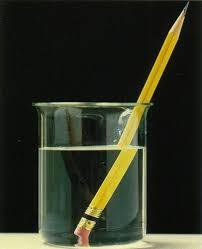
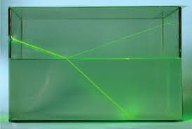
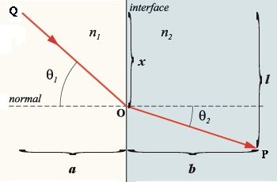

# 光的折射研究

> 我们都见过这样的现象，铅笔被水“折断了”，但是实际上铅笔并没有被折断，而是我们的视觉发生了偏差，本文带你研究一下为什么会发生这样的现象，以及背后的数学原理到底是什么呢？

## 介质
首先我们来看什么是介质？光在空气中传播使我们司空见惯的，除此之外光还可以在水中，玻璃中传播。我们把这样的空气，水，玻璃称为介质。光在不同的介质中传播，会在介质表面发生折射和发射，本文主要研究折射。

## 原理：
> 光总是沿着最短时间传播，而不是最短的距离，因此铅笔会被水“折断”
光沿着时间最少传播和沿着路程最短有区别吗？这当然有区别了，光在单一介质中时间最短就是距离最短，但是发生折射时就不同了。

光希望在空气中多走一点，水中距离少一点。这样时间就会花的更少，这是因为光在空气中比在水中传播速度快。就是因为这点差别，就出现了“折断”的现象。

## 研究
光在不同的介质表面会发生折射现象，折射规律为什么是$\frac{\sin \theta_1}{\sin \theta_2} = n$呢？今天我们使用一点导数的知识证明这个定律。（没有学过导数的小朋友，建议提前看一下高中数学导数部分，很简单的哦）

光在介质表面折射如上图所示，入射光线为$QO$，折射光线为$OP$，入射角和折射角分别为$\theta_1,\theta_2$。假设入射点$O$距离$Q$点投影距离为$x$。则光线从$Q$点传播到$P$点所用时间为：
$$
\begin{equation}\label{time}
f(x) = \frac{\sqrt{x^2+a^2}}{v_1} + \frac{\sqrt{b^2+(l-x)^2}}{v_2}
\end{equation}
$$
此时问题转化为当$x$取何值使得$(\ref{time})$中$f$取得最小值？
$$
\begin{equation}\label{daoshu}
f'(x) = \frac{x}{v_1\sqrt{x^2+a^2}} + \frac{-(l-x)}{v_2\sqrt{(l-x)^2 + b^2}} = 0
\end{equation}
$$
而：
$$
\begin{align}
\sin \theta_1 &= \frac{x}{\sqrt{x^2 + a^2}}\label{t1} \\
\sin \theta_2 &= \frac{l-x}{\sqrt{(l-x)^2 + b^2}} \label{t2}
\end{align}
$$

将等式$(\ref{t1}),(\ref{t2})$ 带入$(\ref{daoshu})$中得出：
$$
\frac{\sin \theta_1}{\sin \theta_2} = n
$$
## 说明
目前本人还没人找到使用初等数学证明折射定律的，有兴趣的同学可以尝试不使用导数。

## 总结
1. 光的折射是因为光喜欢走时间最短的路程；
2. 光在不同介质中传播的速度不同，这就导致光在不同介质中走的距离不同；
3. 大自然就是这样神秘，她似乎会提前预知，并且选择最优的路径。

