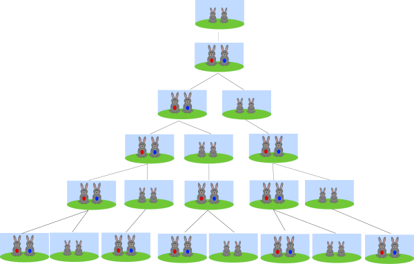

# 斐波拉契数列
意大利人斐波拉契在研究兔子繁殖问题的时候，发现这个数列。我们来看一下这个问题：


> 第一个月有一对兔子刚出生，经过一个月的成长可以继续生育，又生一对兔子。之前的兔子依然保持生育能力。于是兔子的数量与月数的关系：
> 第一个月有1对兔子；
> 第二个月由于兔子成长发育，所以还是1对；
> 第三个月生育一对，就是2对了；
> 第四个月成年兔子生育1对，而上个月刚出生的一对兔子成年，所以就是3对；
> 依次类推下去

## 基本假设
这就是理想的兔子生育问题，就是斐波拉契所研究的，仔细分析这里有几个基本假设：
1. 兔子永不死亡；
2. 兔子一直保持生育能力；
3. 兔子每次生育都恰好是一对雌雄；
4. 兔子没有疾病影响发育，成长时间始终保持一个月；

## 抽象问题
基于以上几个假设可以抽象出数学问题：
**已知一个数列前两项都为1，从第三项开始每项的值都等于前两项之和，求这个数列的通项**

## 初等数学求解
已知$a_1=1, a_2=1, a_n = a_{n-1} + a_{n-2}, n \ge 3$
构造递推公式：
$$
\begin{equation}\label{gouz}
a_n + \alpha a_{n_1} = \beta (a_{n-1} + \alpha a_{n-2})
\end{equation}
$$
化简得到：
$$
a_n = (\beta - \alpha) a_{n-1} + \alpha \beta a_{n-2}
$$

$$
\begin{cases}
\beta - \alpha = 1 \\
\alpha \beta = 1
\end{cases}
$$
解得：
$$
\begin{cases}
\alpha = \frac{\sqrt 5 - 1}{2} \\
\beta = \frac{\sqrt 5 + 1}{2}
\end{cases}
$$
根据方程$(\ref{gouz})$式可知，数列$\{a_n+\alpha a_{n-1}\}$ 为等比数列首项为$1+\alpha$，公比为$\beta$，于是有：
$$
\begin{equation}\label{taox}
a_{n+1} + \alpha a_n = (1+\alpha) \beta ^ {n-1}=\beta ^ n
\end{equation}
$$
对方程$(\ref{taox})$两边除以$\beta ^{n+1}$于是得到
$$
\begin{equation}\label{gouz2}
\frac{a_{n+1}}{\beta ^{n+1}} + \frac{\alpha}{\beta} \frac {a_n}{\beta^n} = \frac{1}{\beta}
\end{equation}
$$
此时构造常数$\lambda$ 使得
$$
\begin{equation}\label{gouz3}
\frac{a_{n+1}}{\beta ^{n+1}} + \lambda = -\frac{\alpha}{\beta} (\frac {a_n}{\beta^n} + \lambda)
\end{equation}
$$
化简$(\ref{gouz3})$以后与$(\ref{gouz2})$对比得到
$$
\lambda = - \frac{1}{\alpha + \beta}
$$
根据$(\ref{gouz3})$可知数列$\{\frac {a_n}{\beta^n} + \lambda\}$为等比数列，首项为$\frac{1}{\beta} + \lambda$ 公比为$-\frac{\alpha}{\beta}$，所以
$$
\frac {a_n}{\beta^n} + \lambda\ = (-\frac{\alpha}{\beta})^{n-1}(\frac{1}{\beta} + \lambda)
$$
$$
a_n = \frac{\sqrt 5}{5} \left[ \left(\frac{1+\sqrt 5}{2} \right)^n - \left(\frac{1-\sqrt 5}{2} \right)^n \right]
$$

## 编程求解
根据抽象的数学问题，编程非常容易得到：

```python
def fib(n):
    ret = []
    a, b = 0, 1
    while b < n:
        ret.append(b)
        a, b = b, a+b
    return ret

if __name__ == '__main__':
    fibs = fib(100)
    print(fibs)
```

```
# 结果为
[1, 1, 2, 3, 5, 8, 13, 21, 34, 55, 89]
```
## 总结
斐波拉契数列的基本假设明显存在不合理地方。从这可以发现，科学研究的基本步骤就是，对于复杂问题先做出假设，简化问题，然后构建模型。之后再不断修正假设，使得研究的问题更加贴近现实条件，是不是发现科学研究也不是很难。

## 参考资料
[斐波拉契数列-维基百科](https://zh.wikipedia.org/wiki/%E6%96%90%E6%B3%A2%E9%82%A3%E5%A5%91%E6%95%B0%E5%88%97)


