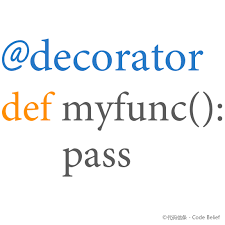

# 技巧篇之装饰器
基于上次`花式编程`的`time_all`函数出现大量重复操作，此处引入装饰器来说明代码的简洁性。装饰器作为Python中的黑魔法，可以使代码更加简洁优雅，常用于检查变量合法性，日志记录等操作。装饰器会在以后详细讲解，此处请自行查阅资料。



```python
def time_it(text):
    def inner(func):
        def _wrapper(*args, **kwargs):
            t1 = time()
            ret = func(*args, **kwargs)
            t2 = time()
            print(text, t2 - t1)
            return ret
        return _wrapper
    return inner
```

装饰在每个函数上

```python
@time_it("循环法用时:")  # 装饰在函数上方即可
def fib2(n):
    """
    指定生成n个菲波拉契数
    """
    ret = []
    a, b = 0, 1
    for i in range(n):
        ret.append(b)
        a, b = b, a + b
    return ret

@time_it("生成器法用时:")
def fib4(n):
    """生成器"""
    a, b = 0, 1
    for i in range(n):
        yield b
        a, b = b, a + b

@time_it("矩阵法用时:")
def fib5(n):
    """矩阵法"""
    ret = []
    m = np.matrix([[1, 1], [1, 0]])
    for i in range(n):
        ret.append((m ** i)[0, 0])
    return ret
    
if __name__ == '__main__':
    num = 10000 # 主函数直接调用
    fib2(num) # 主函数这里还有重复调用，进一步优化
    fib4(num)
    fib5(num)
```

```python
# 结果：
循环法用时: 0.007998943328857422
生成器法用时: 3.814697265625e-06
矩阵法用时: 0.4287300109863281
```
**主函数这里还有重复调用**，对于重复的操作需要进一步优化，此处引入高阶函数`map`, 和匿名函数`lambda`，主函数优化为：

```python
if __name__ == '__main__':
    num = 10000
    funcs = [fib2, fib4, fib5] # 存放调用函数
    for _ in map(lambda f: f(num), funcs): pass
```
```python
# 结果：
循环法用时: 0.0052640438079833984
生成器法用时: 2.1457672119140625e-06
矩阵法用时: 0.3924410343170166
```

这样优化的好处是`funcs`列表可以增加调用函数个数，而不需要修改其余代码：

```python
if __name__ == '__main__':
    num = 10000
    funcs = [fib2, fib5, fib4, fib4, fib5] # 增加函数调用
    for _ in map(lambda f: f(num), funcs): pass
```

```python
# 结果：
循环法用时: 0.006803989410400391
矩阵法用时: 0.38605594635009766
生成器法用时: 9.5367431640625e-07
生成器法用时: 9.5367431640625e-07
矩阵法用时: 0.4611539840698242
```

**注意：对于不懂的知识点，请自行百度，以便于提高自学能力**

## 总结
本文基于上次花式编程的`time_all`函数做了优化，优化的目的使得代码更加优雅，便于阅读和管理。引入装饰器是为了说明编程存在很多技巧。以后会详细介绍，感谢各位阅读。

