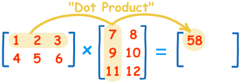

# 矩阵乘法的“奇葩规则”
学习线性代数时，每个人都可能碰到过这样的问题，矩阵的乘法为什么如此奇葩，第一个矩阵行与第二个矩阵对应列乘积之和，依次运算得到最终的积。今天我们来探究一下这个奇葩规则怎么来的。

## 矩阵
矩阵主要用于描述线性方程组，比如：
$$
\begin{cases}
2x + 3y = 10 \\
3x + y = 5 
\end{cases}
$$
用矩阵来表示就是:
$$
\left(
\begin{matrix}
2 & 3 \\ 
3 & 1
\end{matrix}
\right)
\left(
\begin{matrix}
x \\ y
\end{matrix}
\right)=
\left(
\begin{matrix}
10 \\ 5
\end{matrix}
\right)
$$

## 矩阵加减法
矩阵的加减法规则很正常，就是对应元素相加减。回忆加减消元法也能理解规则。
$$
\left(
\begin{matrix}
2 & 3 \\ 
3 & 1
\end{matrix}
\right) +
\left(
\begin{matrix}
1 & 5 \\ 
2 & 2
\end{matrix}
\right) = 
\left(
\begin{matrix}
3 & 8 \\ 
5 & 3
\end{matrix}
\right)
$$
## 数乘以矩阵
数乘以矩阵等于这个数乘以矩阵的每一个元素，想想数乘以方程组，也能理解这个规则。
$$
2 \times
\left(
\begin{matrix}
2 & 3 \\ 
3 & 1
\end{matrix}
\right) = 
\left(
\begin{matrix}
4 & 6 \\ 
6 & 2
\end{matrix}
\right)
$$
## 矩阵乘法
教科书上告诉你是这样的：

也就是说，结果矩阵第$i$行与第$j$列交叉位置的那个值，等于第一个矩阵第$i$行与第二个矩阵第$j$列，对应位置的每个值的乘积之和，是不是够奇葩的。

已知两组方程分别包含$x$与$y$的关系和$x$与$t$的关系，最后希望得到$y$与$t$的关系。
其中$x$与$y$的关系如下：
$$
\begin{cases}\tag{1}
a_{11} x_1 + a_{12} x_2 = y_1 \\
a_{21} x_1 + a_{22} x_2 = y_2
\end{cases}
$$
$$
\left( 
\begin{matrix}\tag{1a}
a_{11} & a_{12} \\
a_{21} & a_{22}
\end{matrix}
\right)
\left( 
\begin{matrix}
x_1 \\ x_2
\end{matrix}
\right) = 
\left( 
\begin{matrix}
y_1 \\ y_2
\end{matrix}
\right)
$$
$x$与$t$的关系如下：
$$
\begin{cases}\tag{2}
b_{11} t_1 + b_{12} t_2 = x_1 \\
b_{21} t_1 + b_{22} t_2 = x_2
\end{cases}
$$
$$
\left( 
\begin{matrix}\tag{2a}
b_{11} & b_{12} \\
b_{21} & b_{22}
\end{matrix}
\right)
\left( 
\begin{matrix}
t_1 \\ t_2
\end{matrix}
\right) = 
\left( 
\begin{matrix}
x_1 \\ x_2
\end{matrix}
\right)
$$
根据方程组的关系，我们将$(2)$方程直接带入$(1)$方程即可：
$$
\begin{cases}
a_{11}(b_{11} t_1 + b_{12} t_2)+a_{12}(b_{21} t_1 + b_{22} t_2) = y_1 \\
a_{21}(b_{11} t_1 + b_{12} t_2)+a_{22}(b_{21} t_1 + b_{22} t_2) = y_2
\end{cases}
$$

$$
\begin{cases}
(a_{11}b_{11} + a_{12}b_{21})t_1 + (a_{11}b_{12} + a_{12}b_{22})t_2 = y_1 \\
(a_{21}b_{11} + a_{22}b_{21})t_1 + (a_{21}b_{12} + a_{22}b_{22})t_2 = y_2
\end{cases}
$$

$$
\left(
\begin{matrix}\tag{3}
a_{11}b_{11} + a_{12}b_{21} & a_{11}b_{12} + a_{12}b_{22} \\
a_{21}b_{11} + a_{22}b_{21} & a_{21}b_{12} + a_{22}b_{22}
\end{matrix}
\right)
\left( 
\begin{matrix}
t_1 \\ t_2
\end{matrix}
\right) = 
\left( 
\begin{matrix}
y_1 \\ y_2
\end{matrix}
\right)
$$
我们将$(2a)$方程直接带入$(1a)$方程即可：
$$
\left(
\begin{matrix}\tag{3a}
a_{11} & a_{12}\\
a_{21} & a_{22}
\end{matrix}
\right)
\left(
\begin{matrix}
b_{11} & b_{12} \\
b_{21} & b_{22}
\end{matrix}
\right)
\left(
\begin{matrix}
t_1 \\ t_2
\end{matrix}
\right)=
\left(
\begin{matrix}
y_1 \\ y_2
\end{matrix}
\right)
$$
明显方程$(3)$和$(3a)$应该相等，所以有：
$$
\left(
\begin{matrix}
a_{11} & a_{12}\\
a_{21} & a_{22}
\end{matrix}
\right)
\left(
\begin{matrix}
b_{11} & b_{12} \\
b_{21} & b_{22}
\end{matrix}
\right)=
\left(
\begin{matrix}
a_{11}b_{11} + a_{12}b_{21} & a_{11}b_{12} + a_{12}b_{22} \\
a_{21}b_{11} + a_{22}b_{21} & a_{21}b_{12} + a_{22}b_{22}
\end{matrix}
\right)
$$
于是得到了“奇葩”的矩阵乘法规则。

## 参考资料
[阮一峰矩阵乘法理解](http://www.ruanyifeng.com/blog/2015/09/matrix-multiplication.html)

