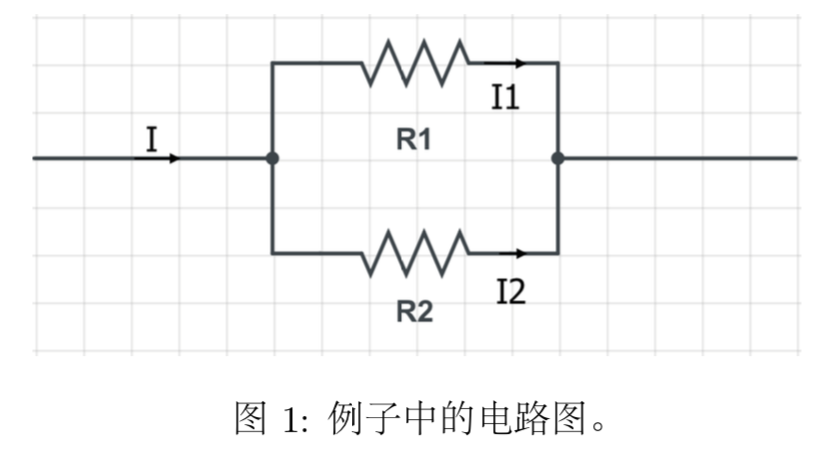
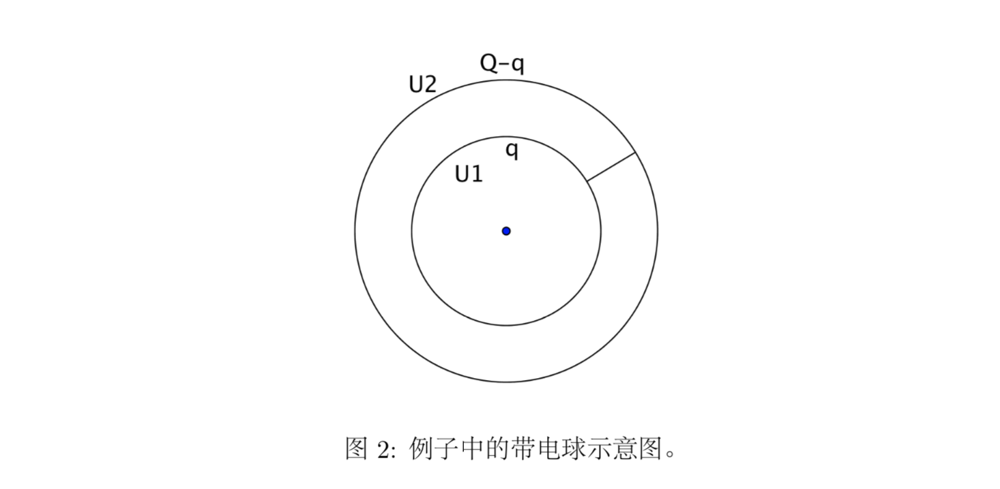
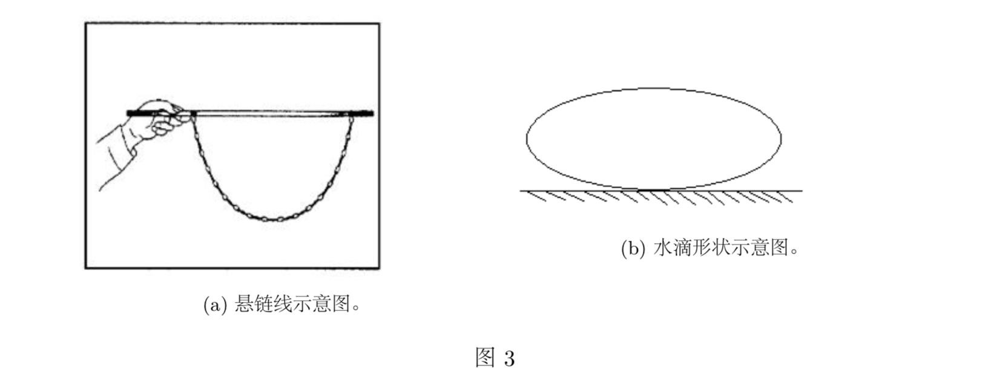

# 物理之美上
>爱因斯坦说过:
>“我想知道上帝是如何设计这个世界的。对这个或那个现象、这个或那个元素的谱
我不感兴趣。我想知道的是他的思想, 其他的都只是细节问题。”

近代物理隐隐约约的表明, 人类似乎已经接近于上帝的终极设计了, 最小作用量原理、对称与守恒可能就是上帝设计世界的原则。最小作用量原理、对称与守恒不同于牛顿第二定律、万有引力定律、胡克定律、库仑定律、这类的普通物理定律, 他是物理定律的定律, 是一切其他普通物理定律的基础。最小作用量原理是一个令人神往的课题。

费恩曼上高中时听到他的老师巴德给他讲的时候就被深深震撼了, 我也是一样。当我第一次从费恩曼的书中看到这个原理时, 真是有种无法言表的喜悦, 好像是我窥见了上帝设计世界的图纸一般。后来我就如饥似渴的学习有关引人入胜的最小作用量原理的知识, 同时越来越被这伟大的原理所吸引。作用量这个概念比较抽象, 我不想一上来就给作用量下定义, 这样会很难理解, 我会由浅入深的介绍。

## 自然中无处不在的极值
观察自然界的各种现象, 会发现极值往往出现。知道这一点非常重要, 在最小作用量被明确提出之前, 人们已经研究了很多极值问题。我们先来看一些比较简单的极值问题, 会对最小作用量原理有一个更深刻的认识, 也能从中看出最小作用量原理的起源与历史。物理定律都有两种表述形式: 一种是普通的我们高中学的形式, 用力、加速度、电场强度等概念描述的物理定律; 另一种是极值的形式, 在一个物理过程中某个量取得极值。这两种表述形式是等价的。

先看一个最简单的例子, 如图1, 两个电阻 R1、R2 并联, 输入的电流为 I, 求 I1、I2 是多少。
这个问题初中生都会做, 用并联时电压相等加上欧姆定律就可以作了。可以容易的求得
$$
\begin{align}
I_1 &= \frac{R_2}{R_1+R2}I \\
I_2 &= \frac{R_1}{R_1 + R2}I
\end{align}
$$

现在我们换一种方法:I1、I2 的取值使得热功率 P 最小。根据焦耳定律有

为了取得 P 的最小值我们对上式两边求导 (以 I1 为自变量)。

可得：

与 (1) 式得到的结果相同。求P的二阶导数发现 > 0, 果然是极小值。

静电平衡也可以用两种方式来解释。为了得到电荷总是分布在导体的表面这个结论, 我们一方面可以利用电荷之间互相排斥来说明; 另一方面, 我们可以利用导体的静电能最低来求出电荷的分布。

看一个小题: 如图2，半径分别为 r 和 R 的同心金属球面以细导线相连, 已知整个系统带有电荷 Q, 求静电平衡时, 内求所带的电荷 q。
我们现在用静电能最低来证明 q = 0。设静电能为 W , 则

为了求得 W 的最小值两边求导 (以 q 为自变量)

因为 r不等于 R 所以 q = 0，我们得到了预期的结果。求 W 的二阶导数发现 > 0, 果然是极小值。
再来看一个例子。如图3a那样把一个铁链子的两端系在水平的棒上, 铁链子会形成一个美妙的曲线 (悬链线)。为了计算这条曲线的方程, 我们可以用受力分析来做, 但还有另一种方法, 即铁链子的真实形 状使得其重力势能最低。你无论怎么改变铁链子的形状, 得到的重心总会比真实情况高。

水珠也很有代表性。如果在太空中忽略重力, 那么水珠会成为球形——相同体积的所有立体图形中表面积最小的, 在物理中我们说表面势能最小 (表面张力会使液体有一个表面势能, 其大小正比于液体表面积)。如果考虑重力, 液体的形状会是怎样的呢? 是哪一个量取最小值呢, 重力势能还是表面势能? 聪明的造物主选择了这么一个量: 重力势能加上表面势能最低。重力尽可能的把重心往下拽, 表面张力 又尽可能的使液体保持球形, 最后就形成了一个扁扁的类似椭球的形状 (不考虑液体与地面之间的分子力)，如图3b。

以上种种现象表明, 造物主似乎是个精明的经济学家, 他总是尽心设计物理定律使得“成本”最小。 很久以前, 人们认为这些极值问题仅仅是一些物理定律的偶然结果, 可是随着理论的发展, 人们似乎慢慢认识到极值才是宇宙中最本质的定律。在今天, 物理学家们已经找到了一种以统一的形式和精确的数学去描述这些极值问题的原理——最小作用量原理。
下一篇文章继续介绍最小作用量原理。

