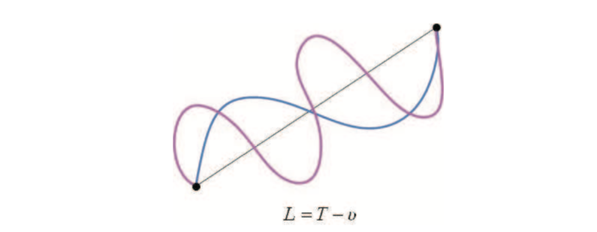
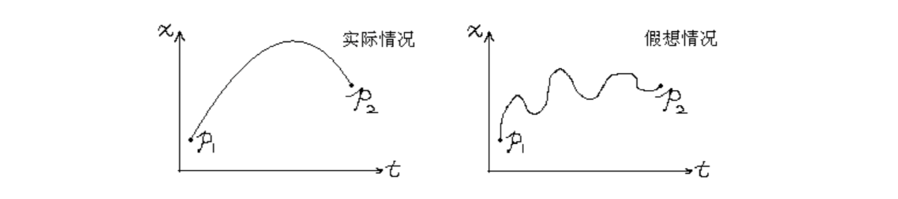

# 物理之美下
本节内容讲牛顿第二定律。这个定律对于一个普通高中生非常熟悉，甚至对于基础好的初中生都可能知道这个定律。记得我上高中那会，觉得很奇怪，一个伟大的定律怎么如此简单，F=ma做一下实验就证明了这个定律。高中课本使用控制变量法证明这个定律，老师还说道牛顿第二定律只能用实验验证，不能理论推导。我当时的想法是“老师我书读的少，你可不要骗我”。

> Richard P. Feynman (1918-1988) 
> 如果你将质点在每一个位置上的动能减去它在这点的位能，然后沿着运动的轨迹对时间做积分，则你得到的数值一定会比依实际上的真实路径积分的值要大一些

## 欧拉-拉格朗日方程
一个运动的系统动能为T，位能为U，则由时刻t1到时刻t2的真正运动路径积分
$$
S = \int_{t_1} ^ {t_2} L(x, \dot x, t) \mathbb dx, L = T - U
$$
产生最小值。

根据分布积分我们可以计算作用量S的变分
$$
\begin{align}
\delta S &= \int_{t_1} ^{t_2} L(x+\delta x,\dot x + \delta \dot x, t)\mathbb dt - \int_{t_1} ^{t_2} L(x, \dot x, t) \mathbb dt \\
&=\int_{t_1} ^{t_2}(L+\frac{\partial L}{\partial x} \delta x+\frac{\partial L}{\partial \dot x} \delta \dot x) \mathbb dt - \int_{t_1} ^{t_2} L(x, \dot x, t) \mathbb dt  \\
& = \int_{t_1} ^{t_2}(\frac{\partial L}{\partial x} \delta x+\frac{\partial L}{\partial \dot x} \delta \dot x) \mathbb dt
\end{align}
$$

然而：
$$
\frac{\mathbb d }{\mathbb dt} \left(\frac{\partial L}{\partial \dot x} \delta x \right) 
= \frac{\partial L}{\partial \dot x}\frac{\mathbb d}{\mathbb dt}(\delta x) + \frac{\mathbb d}{\mathbb dt}\left(\frac{\partial L}{\partial \dot x}\right) \delta x 
= \frac{\partial L}{\partial \dot x}(\delta \dot x) + \frac{\mathbb d}{\mathbb dt}\left(\frac{\partial L}{\partial \dot x}\right) \delta x
$$
因此
$$
\delta S = \frac{\partial L}{\partial \dot x}\delta x |_{t_1} ^{t_2} + \int_{t_1} ^{t_2} \left[\frac{\partial L}{\partial x} - \frac{\mathbb d}{\mathbb dt}(\frac{\partial L}{\partial \dot x})\right]\delta x\mathbb dt
$$
要求所有的路径起点和终点相同，于是有：
$$
\delta x(t_1) = \delta x(t_2) = 0
$$
从而：
$$
\delta S = \int_{t_1} ^{t_2} \left[\frac{\partial L}{\partial x} - \frac{\mathbb d}{\mathbb dt} \left(\frac{\partial L}{\partial \dot x} \right) \right]\delta x\mathbb dt
$$
所以S有最小值的必要条件是$\delta S=0$， 于是得到了欧拉-拉格朗日（Euler-Lagrange）方程。
$$
\frac{\partial L}{\partial x} - \frac{\mathbb d}{\mathbb dt} \left(\frac{\partial L}{\partial \dot x} \right) = 0
$$

## 牛顿力学
根据最小作用量原理得到了欧拉-拉格朗日方程，接下来就可以推到牛顿第二定律了，此时此刻有点小激动。

有这样一个事实: 假定有一个质点在引力场中通过自由运动从某处移动至另一处——你把它抛出去, 他就会上升又落下。如果画出 x − t 图 (为了简化, 只考虑一维的运动, 设 x 轴是竖直的轴), 那么运动图像是一条抛物线。你可以尝试着通过起点和终点画一些别的曲线, 如果计算出经历整条路径期间动能减 重力势能对时间的积分, 你会发现所获得的数值比实际运动所获得的要大。
物体的动能和势能分别为：
$$
T = \frac{1}{2}mv^2, U = U(x)
$$
$$
    L = T - U =\frac{1}{2}mv^2 - U(x)
$$
根据欧拉-拉格朗日方程可知：
$$
\frac{\partial L}{\partial x} = -U',\frac{\partial L}{\partial v} = mv
$$
$$
\begin{equation}\label{newtow}
-U' - \frac{\mathbb d(mv)}{\mathbb dt} = 0
\end{equation}
$$
$$
F = -U' = m\frac{\mathbb dv}{\mathbb dt} = ma
$$
相对论的诞生不是证明牛顿定律不准确吗，那么由最小作用量原理推出了牛顿定律是不是证明最小作用原理也不准确呢，其实并不然，我们仔细观察等式$(\ref{newtow})$可以发现：
$$
\vec F = -U' = \frac{\mathbb d(mv)}{\mathbb dt} = \frac{\mathbb d \vec p}{\mathbb dt}
$$
这里为了更加准确的说明我们写成矢量的形式。合外力等于动量的变化率，此时物体的质量就是运动质量。这个结果非常完美，有没觉得这很**物理**。欧拉-拉格朗日方程式比牛顿第二定律更加根本的定理。而这个方程的发明也将牛顿的经典力学时代带入了分析力学时代。
## 总结
随着人们的认识加深，对于常用的定律或者定理，我们早已不满足于仅仅解决实际问题，需要从理论层面更深刻的揭示客观世界的规律，如果说世界存在统一的规律，我想应该是最小作用量原理了。不仅仅是相对论、量子力学需要最小作用量原理, 甚至同一场理论、弦论都直接把最小作用量原理作为其理论根基。可见, 最小作用量原理已经是物理的灵魂了。

