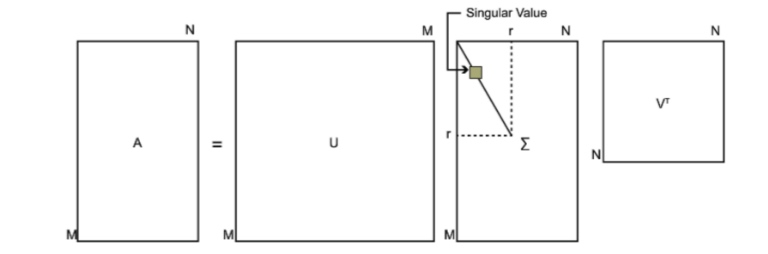

# SVD奇异值分解
奇异值分解（Singular Value Decomposition，简称为SVD）是机器学习中非常基础的算法，主要用于数据降维，推荐系统以及自然语言处理等方面，本节内容先来介绍其数学原理。

## 特征值和特征向量
大学学过线性代数，貌似我对奇异值分解也没有什么印象。奇异值究竟是个什么鬼，我们还得先从特征值和特征向量说起。

$$ Ax = \lambda x $$

其中是$n\times n$实对称矩阵，为$n$维向量。实数$ \lambda$ 称为矩阵，而$x$称为矩阵$A$的特征值$ \lambda$对应的特征向量。

求出特征值和特征向量有什么好处呢？我们就可以对矩阵进行分解了。假设矩阵有$n$个特征值分别是$\lambda_1\le \lambda_2 \le \cdots \le \lambda_n$,对应的特征向量为$w_1, w_2, \cdots, w_n$,记$W = (w_1, w2, \cdots, w_n)$.

$$ A = W \Sigma W^{-1} $$

如果$W$是正交矩阵，也就是说其逆矩阵与转置相等，那么矩阵分解可以写成下面这样：
$$ A = W \Sigma W^{T} $$

前提是这个矩阵必须是方阵才能做这样的分解，如果这个矩阵不是方阵呢？那么这个时候就需要奇异值分解了。

## 奇异值分解
假设$M$是一个$m×n$阶矩阵，其中的元素全部属于实数域(不考虑复数域)。如此则存在一个分解使得

$$ M=U\Sigma V^{T} $$

其中$U$是$m×m$阶酉矩阵；$\Sigma$是$m×n$阶非负实数对角矩阵；而$V^T$，即$V$的转置，是$n×n$阶酉矩阵。这样的分解就称作$M$的奇异值分解。$\Sigma$ 对角线上的元素即为M的奇异值。常见的做法是将奇异值由大而小排列。如此$\Sigma$便能由M唯一确定了。（虽然U和V仍然不能确定）[^1]

接下来就是计算这几个矩阵了。我们知道$M$是一个$m×n$阶矩阵，那么$M^T M$就是$n\times n$阶矩阵了

$$ (M^T M)v_i = \lambda_i v_i  $$

对$M^TM$ 进行分解,得到的特征值$\lambda_i$ 组成的特征向量$v_i$.就得到了$V=(v_1, v_2, \cdots, v_n)$矩阵, 我们把这个矩阵每个向量记做矩阵$M$的右奇异向量。

同样的操作我们分解$M M^T$这个矩阵
$$ (M M^T)u_i = \lambda_i u_i  $$

对$MM^T$ 进行分解,得到的特征值$\lambda_i$ 组成的特征向量$u_i$.就得到了$U=(u_1, u_2, \cdots, u_n)$矩阵, 我们把这个矩阵每个向量记做矩阵$M$的左奇异向量。

现在就差计算奇异值了,也就是这个对角矩阵$\Sigma$。由于$M=U\Sigma V^T$那么
$$MV = U\Sigma V^TV=U\Sigma$$

$$ M v_i= \sigma_i u_i $$

$$ \sigma_i= M v_i/u_i$$

将这些奇异值$\sigma _i$按照大小排列得到的对角矩阵即为$\Sigma=diag(\sigma_1, \sigma_2,\cdots,\sigma_n)$

## 讨论
对于矩阵$M$, 我们接下来讨论一下它的秩$rank(M)=r \le min(m,n)$,对于这种分解$M=U_r\Sigma_rV_r^T$称为**紧奇异值分解**；如果$0<k<r$称为这种分解$M=U_k\Sigma_k V_k ^T$为**截断奇异值分解**，在应用中提到的奇异值分解通常都是截断奇异值分解[^2]。

对于数据压缩来说，紧奇异值分解是一种无损压缩，而截断奇异值分解是一种有损压缩，顾名思义，截断其实就是舍弃了部分奇异值，也就损失了部分特征。

## 参考
[^1]: [维基百科-奇异值分解](https://zh.wikipedia.org/wiki/%E5%A5%87%E5%BC%82%E5%80%BC%E5%88%86%E8%A7%A3)

[^2]: 李航.统计学习方法[M].第二版.北京:清华大学出版社,2019:271-277

