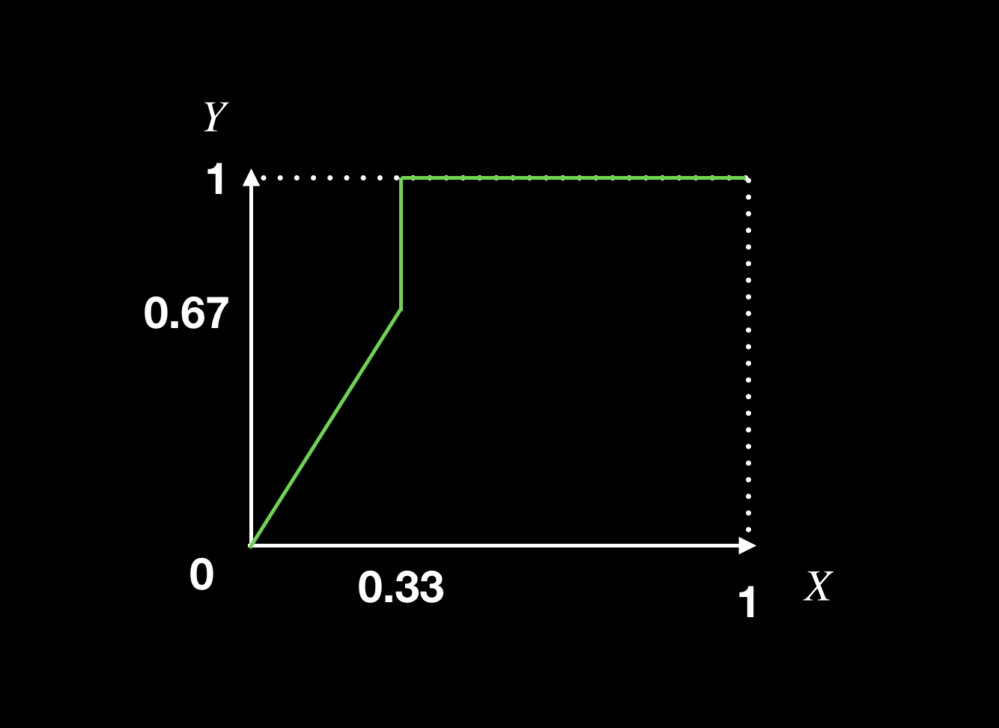

# ROC曲线
最近在新冠肺炎新闻报道中频繁出现一个词“假阴性”。就是检测结果呈现是阴性（没有检测出病毒），实际上是一种假象，真实情况是阳性的。检测结果表现出“假阴性”，后果是非常严重的，相当于你把一个感染者放回家了。今天就来总结一下衡量检测或者说预测结果的方法和指标。

我们把“检测”归纳为“预测”，认为检测新冠病毒实际上就是对**是否感染做预测**，把所有的检测方法抽象成模型。模型的输入就是病人待检测的样本，输出结果为阴性或者阳性两种。如果用函数来描述就是
$$ y = f(x) $$

其中$x$就是待检测样本，$y$就是输出的结果，对应关系$f$ 就是检测的方法。

衡量模型好坏通常有这么一些指标。精度，召回率，$F_{1-score}$，ROC曲线，AUC值等，下面我们分别来介绍这些指标。

## 二分类问题
模型的输出类别，只考虑二分类问题，也就是上面对应的阴性和阳性，通常我们把阴性数值化为0，阳性为1。衡量一个模型的好坏是需要大量的已知样本的，假设我们现在有$N$个样本，分别是$(x_i,y_i),i=1,2,...,N$ 我们通过对样本进行预测，把预测结果与已知结果对比，就能知道这个模型的好坏。

### 准确率
首先你能想到的是**准确率**，模型预测准不准，预测对了多少数据这个是很重要的.那么准确率就是预测对的样本数$R$除以总的样本数$N$。

$$ acc = \frac{R}{N} $$

### 精度，召回率和F1值
我们发现有时候仅仅是**准确率**这个指标是不够，举一个极端点的例子，我们预测某个地方的地震，一天预测1000次，我都说没有地震，那准确率几乎是100%。准确率这么高我不是成大仙了，实际上我就是胡说的，因为某个地方发生地震的概率实在太低。再比如预测A股大盘，我根本不用看大盘，闭着眼说跌，结果一年下来，发现准确率竟然也查过50%。这样的预测结果实际上没有参考价值的。

对于一个已经训练好的模型$f$,我们有6条检验数据，3条正例，3条反例。第2行是模型预测值，第3行是样本的真实值。预测值$\hat y_i=f(x_i)$,将6条验证数据代入模型中，分别得到模型的预测值。

如果按照预测结果大于0.5 就是正例，小于0.5是反例，预测正确的数据为$x_1,x_2,x_3,x_5$共4条数据，准确率就是4/6=0.67.

正确地预测为正例TP（True Positive）分别是$x_1,x_3$ 2条，正确地预测为反例TN（True Negative）的分别是$x_2,x_5$，错误地预测为正例FP（False Positive）分别是$x_6$，错误地预测为反例FN分别是$x_4$。

于是我们得到混淆矩阵（下图），对角线上的数都是预测正确的，其余都是预测错误的。

精度$P$描述的是在**预测为正例的样本**中有多少正例是被正确预测的：
$$P = \frac{TP}{TP + FP}=\frac{2}{3}$$

召回率$R$描述的是在**实际正例样本**中有多少正例是被正确预测的：
$$P = \frac{TP}{TP + FN}=\frac{2}{3}$$

$F_{1-score}$是精度和召回率的调和平均数:
$$ F_{1-score} = \frac{2PR}{P+R} = \frac{2}{3}$$

## ROC曲线
上面的例子中我们假定预测值大于等于0.5为正例，小于0.5为反例，这个0.5称为阈值，阈值是可以根据实际情况改变的。如果阈值改为0.8，那么预测值不小于0.8的才能被划分到正例，原来大于0.5小于0.8的“正例”就被划分为反例了。阈值越大相应被划分到正例的样本就会减少，正例的识别率提高了，意味着对于正例的预测越有把握。

`假阳率`描述在所有实际为阴性（反例）的样本中，被错误地判断为阳性（正例）之比率.
$$ FPR =\frac{FP}{FP + TN} $$
`真阳率`描述在所有实际为阳性（正例）的样本中，被正确地判断为阳性（正例）之比率
$$ TPR=\frac{TP}{TP + FN} $$

ROC曲线的X轴为`假阳率`, Y轴为`真阳率`.通过改变上述的阈值可以得到一些列的点$(FPR, TPR)$,连接这些点就得到了ROC曲线。这些两个比率都是小于1的，因此ROC曲线在1x1的正方形内。接下来分别来计算几个点。

* 阈值等于0.5时，根据上面的混淆矩阵我们计算`假阳率`和`真阳率`：

$$ FPR =\frac{FP}{FP + TN} =\frac{1}{3}=0.33$$
$$ TPR=\frac{TP}{TP + FN}=\frac{2}{3}=0.67 $$

* 阈值等于1时,说明预测值全部是反例，意味着$TP=0, FP=0$,$ TN=3,FN=3$,红色为真实正例，白色为真实反例。

$$ FPR =\frac{FP}{FP + TN} =\frac{0}{3}=0$$
$$ TPR=\frac{TP}{TP + FN}=\frac{0}{3}=0 $$

* 阈值等于0.6，$x_1=0.6$ 不小于0.6都认为预测值为正例。

$TP=2,TN=2,FP=1, FN=1$
$$ FPR =\frac{FP}{FP + TN} =\frac{1}{3}=0.33$$
$$ TPR=\frac{TP}{TP + FN}=\frac{2}{3}=0.67$$

* 阈值等于0.3

$TP=3, TN=2, FP=1, FN=0$

$$ FPR =\frac{FP}{FP + TN} =\frac{1}{3}=0.33$$
$$ TPR=\frac{TP}{TP + FN}=\frac{3}{3}=1$$

* 阈值等于0时，意味着全部预测为正例。

$TP=3, TN=0, FP=3, FN=0$
$$ FPR =\frac{FP}{FP + TN} =\frac{1}{3}=1$$
$$ TPR=\frac{TP}{TP + FN}=\frac{3}{3}=1$$

### 画出ROC曲线
我们分别计算了阈值等1，0.6，0.5，0.3，0，其对应的假阳率和真阳率分别为$(0,0),(0.33,0.67),(0.33,0.67), (0.33, 1),(1,1)$.画出这条曲线就是ROC曲线了。看起来点有点少了，尽量多取一些点，画出来的图形更加好看。曲线下的面积就是AUC值了。

## 总结

AUC（Area under the Curve of ROC）曲线就是对应ROC曲线下的面积

* AUC = 1，是完美分类器，采用这个预测模型时，存在至少一个阈值能得出完美预测。绝大多数预测的场合，不存在完美分类器。
* 0.5 < AUC < 1，优于随机猜测。这个分类器（模型）妥善设定阈值的话，能有预测价值。
* AUC = 0.5，跟随机猜测一样（例：抛硬币），模型没有预测价值。
* AUC < 0.5，比随机猜测还差；但只要总是反预测而行，就优于随机猜测。

ROC曲线越是接近Y轴，意味着分类效果越好。网上已有大量的资料讨论ROC曲线和AUC值，本文不在赘述。本文通过一个简单例子，分别讲述了精度，召回率，F1值的计算方法，同时也计算了不同阈值对应的真阳率和假阳率，出了ROC曲线。在网上也看过很多通俗的文章，大多在讲述得到ROC曲线时省略了很多内容，本文恰好补充了不足之处，对于初学者相对友好。

如果喜欢我的文章，可以关注我的公众号“**数学编程**”。

