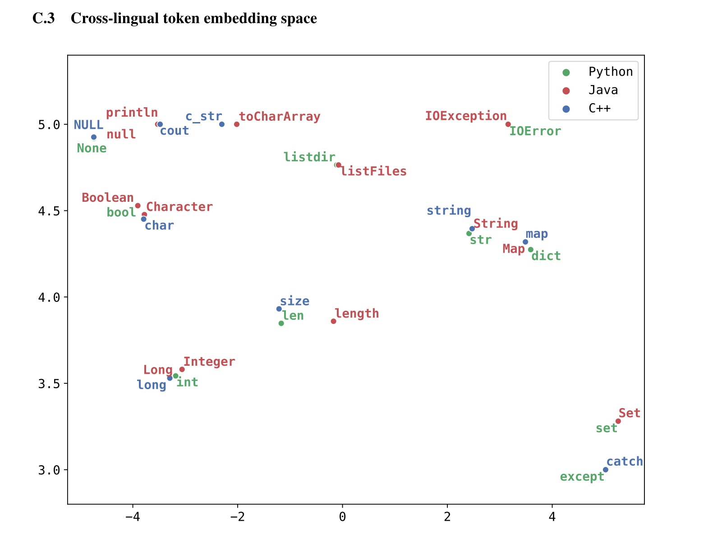
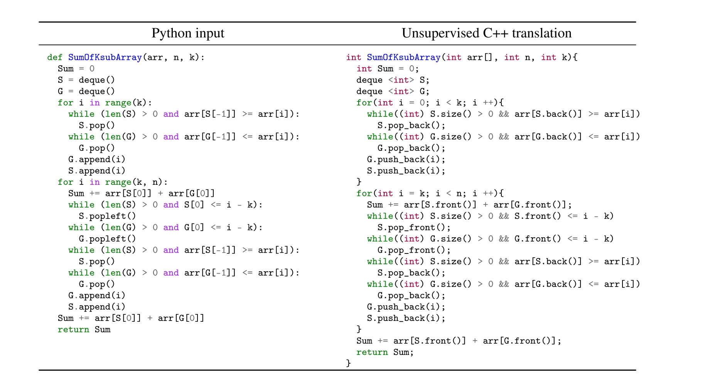
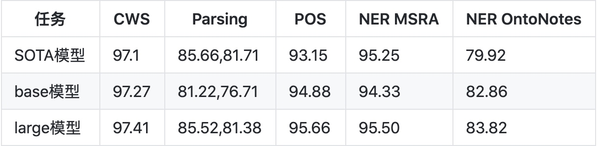
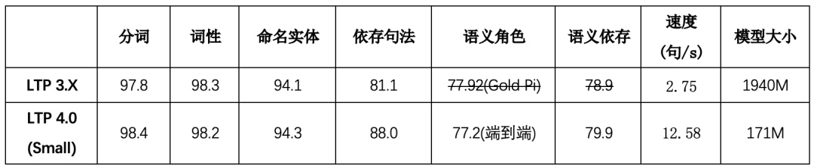

# 最近NLP行业的几个大新闻
最近NLP行业又搞出了一些大新闻，本文整理了几件具有代表性的事件。

## Facebook发布代码互转论文
6月5日，Facebook发布了论文《*Unsupervised Translation of Programming Languages*》[^4]，人工智能领域大佬们相继都转发了这一成果。理论上最好整个项目代码直接转为目标语言，做到这一点是非常具有挑战性的，因此Facebook团队决定采用函数作为转换的单位，这样更容易单元测试。训练数据来源GitHub提交代码。通过无监督训练，可以看到不同语言关键词的词向量分布，效果很理想。

下图为输入Python转为C++语言

好消息是这一成果的准确率并不是很高，转的程序还是存在一些问题，如果程序出现bug怎么办？到底是源语言的问题bug，还是转换模型的问题，很难判断。不过作为一项研究成果是非常有意思的，说不定那天技术突破，得到完善呢。这让广大的码农们稍稍松了一口气。准确率不高这件事情到底是好消息还是坏消息呢？

## OpenAI的GPT-3
5月28日，OpenAI更新了GPT-3模型，发布论文《*Language Models are Few-Shot Learners*》，从论文题目`语言模型是小样本学习者`，很明显这个模型是用于小样本学习的。论文中提到的**预训练模型**都是基于海量语料进行训练的，然后加上微调得到很好的效果[^5]。很明显人类学习确实基于小样本学习的。比如说只要给你看几张斑马的照片，你肯定就学会了。

虽然论文贡献了小样本学习，但是这个模型可不小。训练的参数量达1750亿个参数，如果每个参数算16位的浮点数，也就是2个字节，那么至少需要350G内存。部署这样的模型需要一个集群，然后将很多层进行分布式计算，最终应该可行，代价有点大。

GPT-3除了可以做常规的NLP任务以外，还支持3位数的十进制计算，看起来比较接近一年级小朋友了。1750个参数才接近一年级的小朋友，可想而知人工智能离真正的强智能还有多远。个人感觉，虽然人类是小样本学习，但是大脑可是进化了上亿年，而大脑进化再遗传下去，是不是有点像预训练的然后再微调参数了。

总之这个模型大家可以吃吃瓜，至于部署应用，几乎是不太可能了。

## 邱锡鹏团队最新成果fastHanp

fastHan是基于fastNLP与PyTorch实现的中文自然语言处理工具，像spacy一样调用方便。[^1]

其内核为基于BERT的联合模型，其在13个语料库中进行训练，可处理中文分词、词性标注、依存句法分析、命名实体识别四项任务。fastHan共有base与large两个版本，分别利用BERT的前四层与前八层。base版本在总参数量150MB的情况下各项任务均有不错表现，large版本则接近甚至超越SOTA模型

纯Python代码，安装和使用都非常简单。不得不说预训练的模型带来了极大好处，使得NLP的任务门槛变得越来越低。在不理解算法原理情况下，拿着预训练模型跑一下你的训练数据，效果都不会差。

## 哈工大更新LTP4.0

哈工大SCIR**本科生冯云龙**等同学在**车万翔教授**指导下，于近日对LTP进行了新一轮的全面升级，并推出了LTP 4.0版本。此次升级的主要改进为[^2]：

* 基于多任务学习框架进行统一学习，使得全部六项任务可以共享语义信息，达到了知识迁移的效果。既有效提升了系统的运行效率，又极大缩小了模型的占用空间
* 基于预训练模型进行统一的表示 ，有效提升了各项任务的准确率
* 基于**教师退火模型蒸馏出**单一的多任务模型，进一步提高了系统的准确率
* 基于PyTorch框架开发，提供了原生的Python调用接口，通过pip包管理系统一键安装，极大提高了系统的易用性

以前的版本在处理NLP基本任务时都是分模型的[^3]，就是处理中文分词、词性标注、依存句法分析、命名实体识任务时需要加载不同的模型，而这次全面升级，采用了Joint Learning的多任务模型，还取得了这么好的效果，证明参数共享的方式比单任务更容易学到强特征。本科生能作出这样的成果，这才是真正的后浪。

## 参考
[^1]: [邱锡鹏知乎](https://zhuanlan.zhihu.com/p/147665538?utm_source=wechat_session&utm_medium=social&utm_oi=56560353017856)
[^2]: [哈工大SCIR公众号](https://mp.weixin.qq.com/s/mpovrWXzMC-661wL3ApJew)
[^3]: [哈工大 pyltp](https://pyltp.readthedocs.io/zh_CN/latest/api.html#id10)
[^4]: https://arxiv.org/abs/2006.03511
[^5]: https://arxiv.org/abs/2005.14165