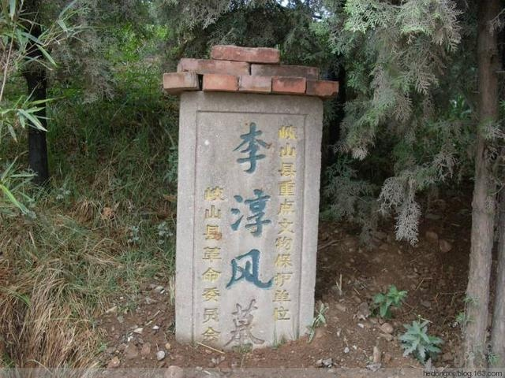
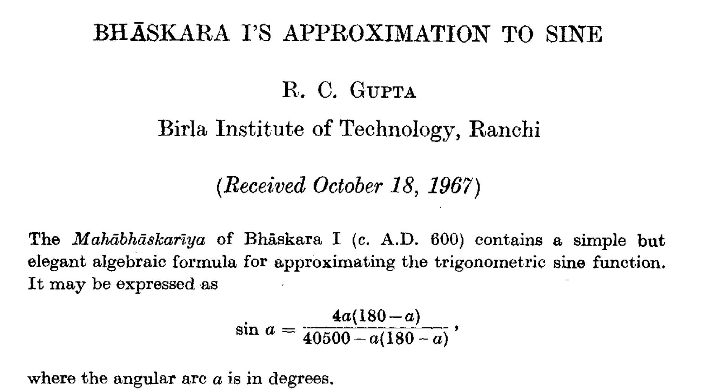
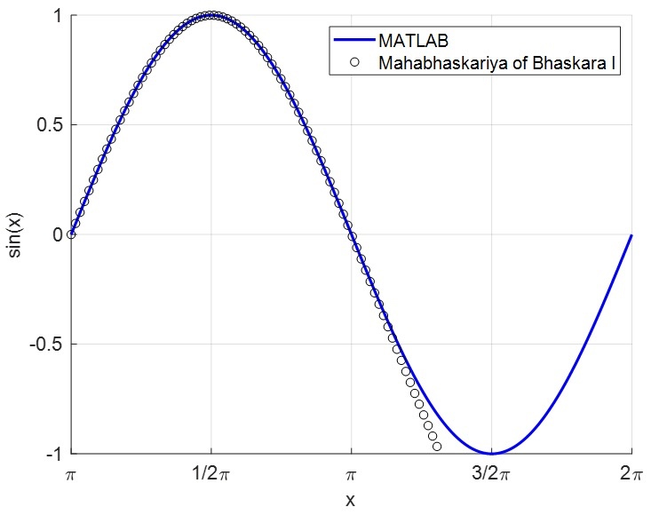

# 穿越1400多年的sin近似公式
前不久看完了《鬼吹灯之龙岭迷窟》，这次演员阵容还不错，潘粤明、张雨绮、姜超，还加盟了几位香港演员，特效方面比之前的《怒晴湘西》要好很多，剧中的陈瞎子就是《怒晴湘西》中潘粤明饰演的陈玉楼，陈瞎子演得很好，神秘又阴险狡诈，最后还吐槽了一波专家，哈哈哈。

盗墓的主题拍成了保护文物，这个点无需多说。除此之外，从头到尾真的是在弘扬的传统文化，比如寻龙点穴，易经八卦，迷魂梯，......。这些是不太懂了，里面提到的浑天仪是有记载的，墓主李淳风也确有其人，今天就聊聊隋唐时期的天文学家李淳风和同时期的印度数学家Bhāskara I，重点看看Bhāskara I 的sin近似公式。

## 李淳风其人
李淳风（602年－670年），岐州雍人（今陕西省凤翔县），唐朝初年政治人物、天文学家和数学家[^1]。李淳风早年学道于天台山，最早是隋炀帝的司监官。他通晓天文星象，历法以及数学。父亲李播是隋时的高唐县尉，后放弃官职为道士，道号黄冠子，著有《天文大象赋》。



先来看两个故事：
> 一日，唐太宗得到一本秘谶，上面说：“唐中弱，有女武代王。”，李淳风预知武后将称帝，并诛杀唐氏子孙殆尽。太宗欲杀之，李淳风谏言：“不可。陛下若留，虽皇祚暂缺，而社稷延长。陛下若杀之，当变为男子，即损减皇族无遗矣。”太宗遂止[^2]。

> 刘𫗧的《隋唐嘉话》记载淳风能预测日蚀，唐太宗颇不信其言，李淳风说：“有如不蚀，则臣请死之。”一日唐太宗等不至日蚀，于是对李淳风说：“我放你回家，和老婆孩子告别。”李淳风在墙上划了一条标记说：“尚早一刻。等到日光照到这里时，日食就出现了。”后来果“如言而蚀，不差毫发”。一日李淳风与张文收同皇帝出游，有狂风从南面迎来，李淳风认为在南面五里处一定有人在哭，张文收则认为那里有音乐声。后来果然有一送葬仪队经过[^3]。

这两个故事太玄学了，夸张到可以预测未来。说起预测未来，传说李淳风与袁天罡合著的《推背图》真的能预测未来，只不过现存的推背图有六个版本。能占卜未来，就问你怕不怕。故事归故事，但浑天仪是真实存在的，说明李被称为天文学家是当之无愧的，要是能有发明浑天仪的手稿那就更好了，这样才能看到当时的数学天文学发展到什么程度了。

## Bhāskara I
公元600-680年，印度的数学家。第一个用圆圈表示十进制的0，同时给出了sin函数的近似公式。
$$
    \sin a = \frac{4a(180 - a)}{40500 - a(180 - a)}
$$
其中a表示度数，介于（$0-180^o$），不是现在用的弧度。还找到了1967年关于这一贡献的论文[^4].



这个公式确实很厉害，下图可以直观的看到，误差很小了。误差究竟多小呢?我们在（$0-180^o$）之前取1000个点，标准差是0.000973。



参考程序：

```python
import math
import numpy as np


approx_sin = lambda a: 4*a*(180 - a) /(40500 - a*(180 - a))

x = np.linspace(0, math.pi, 1000) # 取1000个样本点
xx = x * 180 / math.pi # 转为角度

sigma = math.sqrt(sum((approx_sin(xx) - np.sin(x)) ** 2) / len(x))
print(sigma)
```

## 总结
最近娇妹在整理数学资料，我偶然间瞄了一眼，教材改革和题目设计都在偏向于中国古代数学。这样其实挺好的，能了解到中国数学的贡献，增强民族自豪感。我看了一些内容，似乎是为了选择而选择，忽视了内容本身的恰当性。找一个例子然后就大谈文化层面的东西，不是本号的风格。

本文主要讲述了印度数学家Bhāskara I（Bhāskara II区别）的近似公式。由于保存有手稿，参考论文中详细解读了手稿内容，以及推算过程。有兴趣的可以去看看整个演算的思路。

## 参考
[^1]: https://zh.wikipedia.org/wiki/%E6%9D%8E%E6%B7%B3%E9%A2%A8
[^2]: 《新唐书·列传第一百九十五·方技》
[^3]: 《太平广记》卷第七十六方士一
[^4]: https://insa.nic.in/writereaddata/UpLoadedFiles/IJHS/Vol02_2_3_RCGupta.pdf