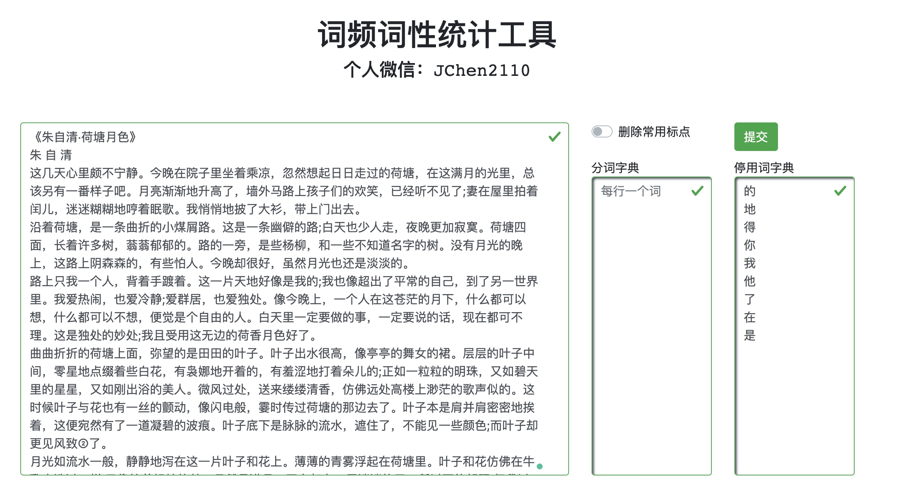
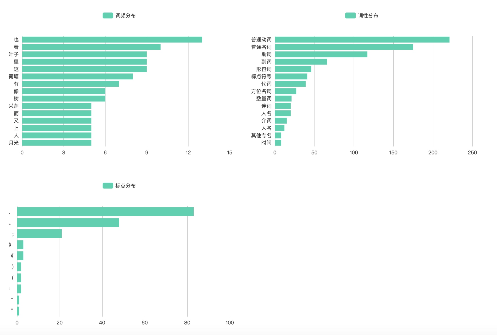
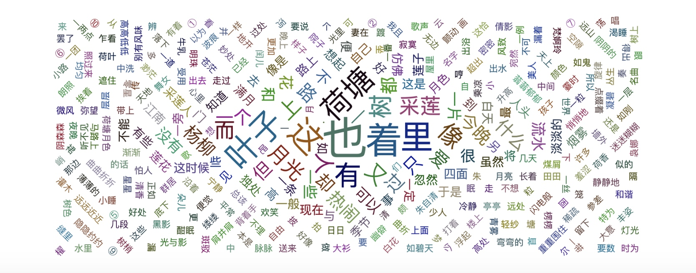

# 词频词性统计工具

对于文字工作者，和内容运营的朋友，经常需要统计**词频词性**，然后画出**词云图**这样的需求。本文推荐一种词频词性统计工具，并且可以自动画出词频图和词云图，先介绍这款软件的基本功能。

文本字数默认不超过1万字，分别支持自定义分词字典和停用词。一键提交即可查看结果。结果包含词频、词性、常用标点等分布图：

 
 当然还有词云图：
 
 

我们发现朱自清在《荷塘月色》里用得最多的字是“也”，这应该算是他的用语习惯吧。

## 重点
如果你只要如下需求：
1. 不超过1万字文本
2. 只统计词频、词性、标点、和方形词云图。

以上需求是免费的，如果超出以上需求，需要一定费用了。

个人微信：JChen2110
QQ号：971516583
邮箱：cj194832@163.com
