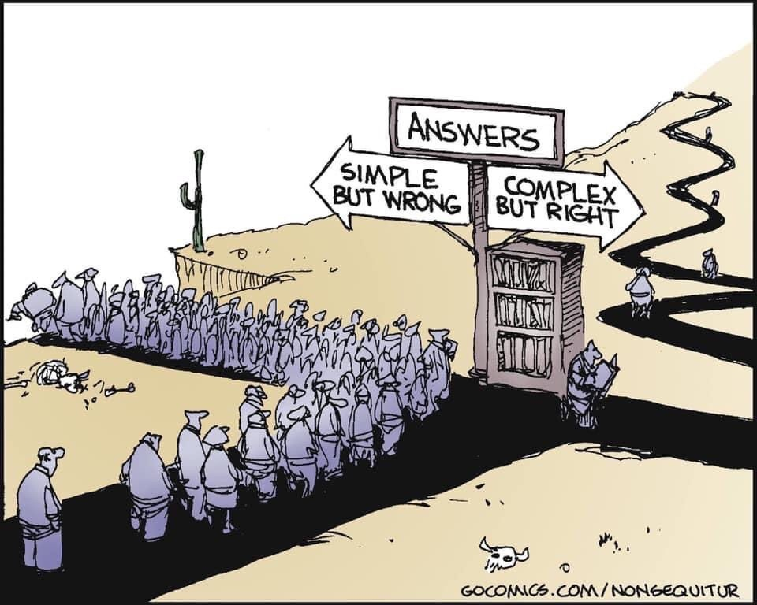
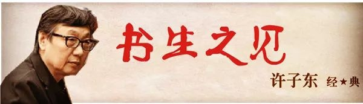
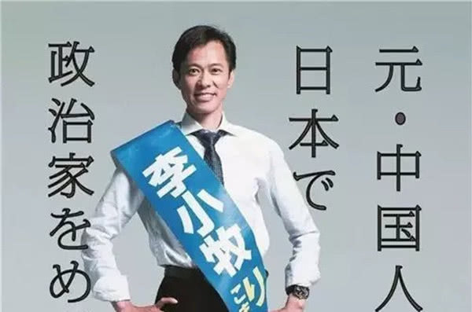

# 2020年上半年，你的目标完成了多少

今年是2020年，放在历史里面意味着21世纪初结束了，进入到20年代，之后每个年代只有十年时间。时间过得很快，似乎不是匀速，像极了加速而过。疫情还没有完全结束，半年已经过去了，2020年你的目标完成一半了吗？反正我的还差很远😂。

没有任何人能预料到今年的黑天鹅事件，我觉得能平安无事就已经是幸福了。在病毒面前人类真的太脆弱了，几乎没有还手之力，我们能做的就是减少外出，避免被感染和感染别人，每个人都做好自己能做的事情，就是对疫情最大的贡献。

计划了大半年的婚礼，本来要在今年年初举行的，也被临时取消了。我跟老婆解释说，这种百年不遇的瘟疫，一定会被载入史册，我们婚礼定在疫情爆发的年初，也很有纪念意义。并且承诺说，以后我们每过5年都去拍婚纱照，这样我们会有很多结婚的回忆。这才勉强安慰过去，幸好老婆是通情达理之人。

年初我给自己定了一些目标：
1. 积累专业知识
2. 至少完成50篇文章（包含公众号文章）
3. 读十本书
4. 托福分数超过80分
5. 去日本旅行
6. 股票基金收益超过20%

## 专业知识积累
现在从事自然语言处理行业，是人工智能的一个分支，充满挑战也很有趣味。经常会看到别人做的非常有意思的成果，行业内同时也存在很多无法解决的问题。新兴行业既有机会也有挑战，还是挺适合的。

专业知识主要从这几个方面积累。1、肯定是读论文，偏向于研究，了解行业的动态，目标是今年读完100篇论文。2、学习编程能力以及底层原理，就包括算法原理和程序原理。3、整理技术专栏。输出是最好的学习方式，把你所学的东西系统地整理出来。积累专业知识方面算是完成了一半的工作。

## 至少完成50篇文章
整理的技术文章和个人思考感悟，同步发在微信公众号和博客，有些内容不适合放在公众号的就放在博客上。半年过去了，一共完成了22篇公众号文章，加上几篇博客文章和个人专栏，也完成了一半的任务。

公众号注册了很久，中间很长一段时间没有更新。发现关注人数上涨了一些，既然有人看，那就继续更新吧。最近放上了广告，希望能够靠写公众号挣一杯咖啡钱。我看了后台数据，一个写技术文章的，阅读量最高的是一篇影评（有点汗颜）。估计还是覆盖的群体不对，想挣咖啡钱估计还得好好运营。

## 读十本书

这个目标当初是定高了。十本书，现在想想不可能完成了。床头放着两本有关日本文化的和一本《宋史研究》还没翻几次呢，许子东老师的两本书，其中《书生之见》看了一半。杂志周刊看了几本，就这么多了。十本书寄希望于下半年能完成多少了。

## 剩余三点
内容不想写太多，放在一起说了吧。一直想学英语，工作学习中都能用得上，英文写作能力欠缺一点，阅读基本上没太多问题，希望能够系统的学习，顺便考个证。目前还停留在听句子练习的阶段，估计十分之一都没达到。

说起对日本的印象，以后再详细说，我从一个不喜欢日本到现在非常喜欢日本，中间发生了什么，一两句话说不清。对日本人文社会都很好奇，于是买了两本关于日本文化的书。还没看多少又转去读李小牧的新书了。一直想去日本旅行一趟，可惜一直没有时间和机会。

股票基金算是偶尔玩玩，普通人买港股美股有难度，除了大A没有选择，而大A股呢，完全不具备投资价值，只能用来投机。毕竟十多年了大盘还在3000点附近徘徊，说多了都是泪。不过今年运气还不错，半年时间已经超额完成了目标，假如要除开通胀的话，估计还是差一点。

以上是我的2020年上半年做的事情。除了托福考试和读书计划，其余都完成的还不错。定一个长期的计划，然后尽量分解到每一个月，这样会使你有目标感，清楚每一天应该做什么。2020年上半年，你的目标完成了多少？如果还没有完成一半，那么你应该思考一下原因，或者调整一下目标。