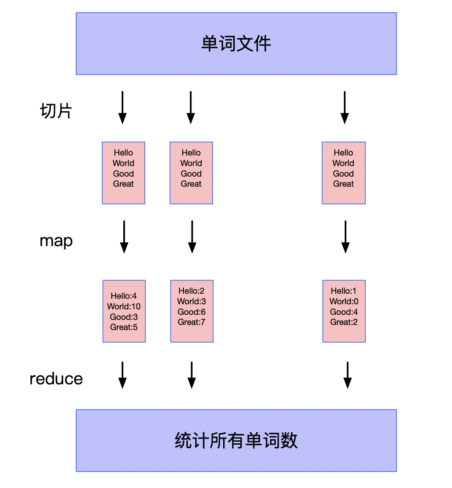

# 用Python模拟MapReduce分布式计算

谷歌最早提出了一种分布式计算框架，就是MapReduce。当时发布这个框架的时候，一句话形容那是相当火爆啊，主要用来解决大规模数据（大于1TB）的并行计算。提出了两个核心过程分别是Map和Reduce过程。

大致的过程就是先将大规模数据进行分块，每个块通过映射函数处理得到独立结果，整个过程是高度并行的，这个过程称为Map。将上面的结果进行归纳操作，得到最终的结果，这个过程称为Reduce。简单说就是先拆分后合并。

在Python的函数式编程中，也有类似的函数map和reduce，这两个函数与MapReduce框架有什么联系呢？**通过本文你不仅能够学会map和reduce函数的使用，还能了解分布式计算的基本原理。**

## map函数
map函数是一种高阶函数，接收一个函数和一个可迭代对象作为参数，计算的过程就是将这个函数并行地映射到可迭代对象的每一个元素上。举个例子：

```python
>>> l = [1,2,3,4]
>>> q = map(lambda x: x**2, l) # 返回map对象
>>> list(q) # 转为list
[1, 4, 9, 16]
```

定义了`lambda`函数是进行平方的操作，然后将这个操作映射到列表`l`的每一个元素上，最终得到结果`q`。如果列表足够大，使用map函数会比循环操作效率高很多，这个可以很容易测试出来，本文暂时不赘述了。

## reduce函数
reduce函数也是一种高阶函数，按照某种操作对可迭代对象进行归纳运算。reduce可以实现很多操作，我们简单看几个$1+2+...+100$, $n!$, $2^{3^4}$。

```python
>>> reduce(lambda x, y: x+y, range(1, 101)) # 计算从1到100的和
5050
>>> reduce(lambda x, y: x*y, range(1,6)) # 计算5!=120
120
>>> reduce(lambda x, y: y ** x, [4,3,2]) # 2^3^4
2417851639229258349412352
```

用起来是挺简单的吧。接下来我们利用map和reduce函数来模拟分布式计算，大致了解mapReduce的原理。

## 模拟分布式计算
作为分布式计算的入门例子**wordCount**，是统计大文件中每个单词的个数。任务非常简单，如果这个文件的大小超过了单机的内存，处理起来很困难，我们需要借助集群来完成这个统计任务。下图是本文程序的流程：



首先导入使用的包

```python
from functools import reduce
import numpy as np
from typing import List, Dict
from collections import defaultdict
```

首先我们模拟生成单词文件,每个单词假设3个字母。输出文件名称为`words.txt`.

```python
def generate_random_words_file(sample_num: int = 100):
    """
    生成随机字母的样本文件
    :param sample_num: 样本数
    """
    # 97-122 ==> a-z
    with open("words.txt", "w") as fd:
        random_words = np.random.randint(97, 110, (3, sample_num))
        for row in range(sample_num):
            words = "".join([chr(each) for each in random_words[:, row]])

            fd.write(words + "\n")
```

接下来读取单词文件，然后进行分块。我们就直接分块读取，默认块大小为10个单词。

```python
def read_file_by_chunk(lines: int = 10) -> List[List[str]]:
    """
    分块读取文件
    :param lines: 行数
    """
    res = []
    with open("words.txt") as fd:
        tmp_chunk = []
        for idx, line in enumerate(fd.readlines(), start=1):
            tmp_chunk.append(line.strip())
            if idx % lines == 0:
                res.append(tmp_chunk)
                tmp_chunk = []
    return res
```

对大文件进行分块以后，接下来对每个块文件进行map映射，统计出每个块的单词数量，返回字典数据，映射函数作为map的参数。

```python
def map_count(data: List[str]) -> Dict[str, int]:
    """
    统计单词个数
    """
    word_count = defaultdict(int)
    for item in data:
        word_count[item] += 1
    return word_count
```

有了映射函数，接下来写归纳操作。归纳操作的函数只需要完成两个map的计算，这个函数将作为reduce的参数，将所有map结果进行归纳。

```python
def reduce_count(data1: Dict[str, int], data2: Dict[str, int]) -> Dict[str, int]:
    """
    合并两个map
    """
    for k, v in data2.items():
        data1[k] = data1[k] + data2[k]
    return data1
```

定义完map和reduce以后接下来完成主函数.模拟生成10万个单词的文件，每个数据块100个单词，通过MapReduce计算以后，输出词频最高的前10个单词。

```python
if __name__ == '__main__':
    generate_random_words_file(sample_num=100000)
    data_chunk = read_file_by_chunk(lines=100)  # 数据切片
    map_res = map(map_count, data_chunk)  # map
    reduce_res = reduce(reduce_count, map_res)  # reduce
    reduce_res = sorted(reduce_res.items(), key=lambda x: x[1], reverse=True)  # 排序

    for each in reduce_res[:10]:
        print(each)
```

输出结果:

```python
('ckk', 72)
('cak', 72)
('lae', 72)
('mah', 68)
('abe', 67)
('gcg', 67)
('jlg', 66)
('hmf', 66)
('bmd', 65)
('jem', 64)
```  

## 总结
map和reduce函数是Python内置函数，效率极高。常用于函数式编程中，可以有效地避免使用for循环。本文用这两个函数模拟了MapReduce分布式计算过程，真实的分布式是将每个数据块分到不同的节点进行计算，然后再将计算的结果再归纳到同一个节点输出。大规模数据正式通过这样的MapReduce过程，由集群完成计算。技术变更很快，MapReduce框架早已被取代，但是分布式计算的思想一直被继承下来。
