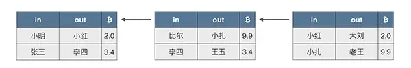
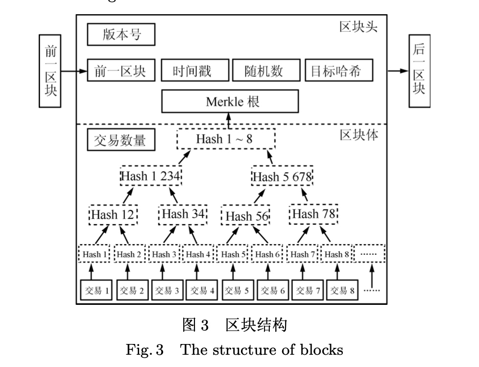

# 区块链介绍（1/N）
近几年来区块链技术非常热门，2019年10月，国家领导人提出大力发展区块链技术[^1],目前区块链最大的落地应用应该是虚拟货币了，其中比特币是最有名的，也是占有份额最大的。截止目前比特币的单价已经涨到9436美元。

很多人无法理解，也包括一些经济学家，虚拟货币为什么会有价值？就是一串数字而已，没有国家信用作保障，为什么可以作为货币流通。关于虚拟货币行使货币功能的文章非常多，这是一个经济学话题，本文不过多介绍。本文的重点在于介绍区块链的技术原理，了解了原理很多问题就容易理解。

区块链技术起源于2008年由化名为 “中本聪” (Satoshi nakamoto) 的学者在密码学邮件组发表的奠基性论文《比特币: 一种点对点电子现金系统》, 目前尚未形成行业公认的区块链定义. 狭义来讲,**区块链是一种按照时间顺序将数据区块以链条的方式组合成特定数据结构, 并以密码学方式保证的不可篡改和不可伪造的去中心化共享总账**。[^2]

首先需要区分两个概念，区块链和比特币，区块链是比特币的技术原理，比特币是区块链其中的一个应用，仅仅是众多数字货币中的一种。上面给出的定义严谨，可以理解为**区块链的本质是分布式的记账体系，每个区块打包了交易的账单或者合约，所有的区块组成一条链，我们把整个链称为区块链**。根据区块链的定义，接下来打算从一下几个方面介绍：

1. 分布式记账体系
2. 单个区块包含哪些内容
3. 如何构成一条链

上图选自廖雪峰官方网站[^3]。从左到右构成一条区块链，每个区块打包了多个账单或者合约。

## 分布式记账体系

分布式系统是由一组通过网络进行通信、为了完成共同的任务而协调工作的计算机节点组成的系统[^4]。在区块链中最重要的任务就是记账，所有的账单数据都会同步到每一个计算机节点上，这样每一个节点的数据都是等价的。这就是所说的**去中心化**。

我们使用现金或者移动支付，最终的交易都在银行，银行记录着每个人的消费账单。例如你要完成一笔转账，当你提交转账的订单以后，银行首先查询你的余额，判断这比转账是否合法，如果合法，则修改你们的银行卡余额。那么银行在这个交易过程中就是中心地位。

比特币的转账直接点对点（p2p），张三要给李四转账，只需要验证张三余额够，然后直接转入到李四的账户中。转账的账单会广播到每一个节点，所有的节点都会同步这个账单。由于钱包的地址是一串数字，别人只知道发生了这笔交易，并不知道交易双方的信息。这也有利的保护了个人隐私。

分布式带来的最大好处应该是**去中心化**，每个节点都保存了账单内容，并且账单信息通过**Merkle哈希树**，以保证信息不可篡改。如果拥有全网51%的算力，理论上存在修改区块的可能性（看完了挖矿原理就能理解）。点对点的交易虽然方便但也会带来一些问题，比如你的私钥如果丢失了，意味的货币也就无法找回了；如果转账人的地址写错了，你也无法追回这笔转账。后面的文章会详细介绍转账的过程。

## 交易账单的内容
区块如果记录的是交易的账单，就是一种数字货币。除了记录账单还可以记录`合约`和`执行脚本`，这被称为区块链的第二代应用**智能合约**，这部分内容后续慢慢介绍，先来看数字货币账单的内容。

区块记录交易的账单，每个账单记录实际的转账清单。上图顺序从左到右，第一列为转账人，第二列收款人，第三列为交易额。这样每个人货币的来源都能很清晰的追溯到，数字货币的世界里不存在洗钱和假币。

## 如何构成一条链
一个区块包括区块头和区块体。下图是一个区块的结构图，区块头包括版本号、前一区块的哈希值、时间戳、随机数、Merkle根哈希值、目标哈希。区块体主要就是交易的账单信息，下面的树状结构就是Merkle哈希树。

在区块头有两个哈希值，`前一区块`指向上一个区块的`目标哈希`.而当前区块的`目标哈希`指向下一个区块的`前一区块`，这样就形成了一条长链，由于哈希值的唯一性，就决定了区块不可篡改，如果任何一个区块发生变化，目标哈希就是改变，后面的链就"断掉了"。

## 简介哈希函数
哈希函数是一个映射函数，**可以把任意长度的输入数据转化为固定长度的输出**，这个输出通常用16进制表示。常用的哈希函数有MD5、RipeMD160、SHA-256，SHA-512等函数。比特币使用的哈希算法有两种：SHA-256和RipeMD160。哈希函数应该满足如下几个特点：

1. 输出是单向不可逆
2. 输出是无规律
3. 计算效率极高

这几点很好理解。第一点输出单向不可逆的，信息加密的过程中不能根据加密结果推到出原始信息，都在加密等于形同虚设；第二点输出结果是无规律的，那么两个非常相近的输入，输出结果也是千差万别；第三点计算效率极高，因为在区块链的挖矿过程中，非常频繁地计算哈希值，如果效率不高会导致大量交易堵塞。

既然哈希函数是将任意输入数据映射到固定长度的数据。就是把一个无限的集合映射到有限的集合上，那就可能存在不同的输入，输出结果相同，这种情况称为哈希碰撞。处理哈希碰撞的办法就是降低碰撞的概率，输出结果位数越多，其碰撞的概率就越低，当然太长会影响计算效率。

## 总结
本文介绍了区块链的基本原理。尽量避免复杂的密码学计算。通过本文你应该对区块链和数字货币有一个直观的认识。区块链是根据时间先后链接很多区块，每个区块包含区块头和区块体，区块头主要用来连接上下区块，区块体包含了交易的账单。同时也简单介绍了哈希函数。接下来会逐步介绍算法原理和密码学的计算。

## 参考
[^1]: http://www.xinhuanet.com/politics/leaders/2019-10/25/c_1125153665.htm
[^2]: 袁勇,王飞跃.区块链技术发展现状与展望.自动化学报[J].2016,42(4)
[^3]: [廖雪峰官方网站](https://www.liaoxuefeng.com/wiki/1207298049439968/1311929706479649#:~:text=%E5%8C%BA%E5%9D%97%E9%93%BE%E5%B0%B1%E6%98%AF%E4%B8%80%E4%B8%AA,%E7%9A%84%E5%85%A8%E7%BD%91%E7%AE%97%E5%8A%9B%E3%80%82&text=%E6%AF%8F%E4%B8%80%E4%B8%AA%E5%8C%BA%E5%9D%97%E8%BF%98,%E4%BA%A4%E6%98%93%E8%AE%B0%E5%BD%95%E6%97%A0%E6%B3%95%E8%A2%AB%E7%AF%A1%E6%94%B9%E3%80%82)
[^4]: 百度百科关于分布式系统