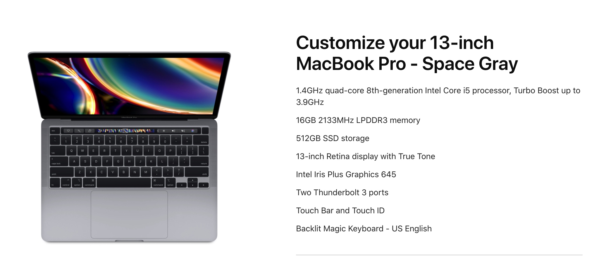

# 感谢娇妹的生日礼物
这个生日礼物说起来很有意思，是我说服了娇妹给我送的礼物。一开始娇妹听说一台电脑要一万多，也太贵了吧，说我现在不是有一台用着吗？于是我跟她讲了一个故事（切记不要讲道理）。

我小的时候，爸妈给我买点糖吃，就会很幸福很满足。到了小学初中，糖已经不能满足了，因为糖很便宜，很容易买到，需要各种新奇的零食才能获得满足感。到了高中大学，我们同学一起出去搓一顿火锅，吃得非常的开心。但是现在工作几年以后呢？再去大吃大喝，估计也不会有太多兴趣，赚钱、平衡工作与家庭是最重要的，也是最让我开心的事情。

除此之外，我们工作使用电脑的频率非常高，我又很喜欢苹果电脑。要是再过几年，电脑可能对我来说也没那么重要了。不同的阶段给你带来幸福感的东西不一样。你说要是送我这样的礼物，既能让我非常的开心，也能满足我的使用需求，还能长时间地让我想起这是你送我的礼物，常怀一颗感恩之心，你觉得这个礼物值不值？

于是我顺利地拿到了娇妹给我的礼物。不过呢，娇妹手里的苹果设备比我还多，前段时间还说要买Watch😂，我在考虑要不要让她召唤神兽。

我一直认为如果你不玩游戏，只是用来办公的话，Mac或者iPad Pro就是你最好的选择。我上一台电脑是2017年在香港买的，之后成功地推荐了几个朋友都入手了。至于好不好用呢，没用之前你是不知道的。

过生日对于我来说非常简单，礼物已经收到了。早早地下班回来，晚上跑完步，路边再来一顿烧烤，我现在跑步最大的动力就是吃😂，寻找各种小吃。没办法，体育馆附近全是吃的，跑步的时候，时不时能闻到烧烤的香味，来回的路上也是各种小摊，这能怪我吗？

也有人说我又胖了，哎！这不是胖了，而是遭受了社会的毒打，鼻青脸肿而已。要不是还坚持运动，早就肿得不成人样了。感谢娇妹的礼物，非常的开心。有喜欢的东西趁早买，喜欢的事情趁早做，喜欢的人趁早追，不要等，否则你会错过很多。