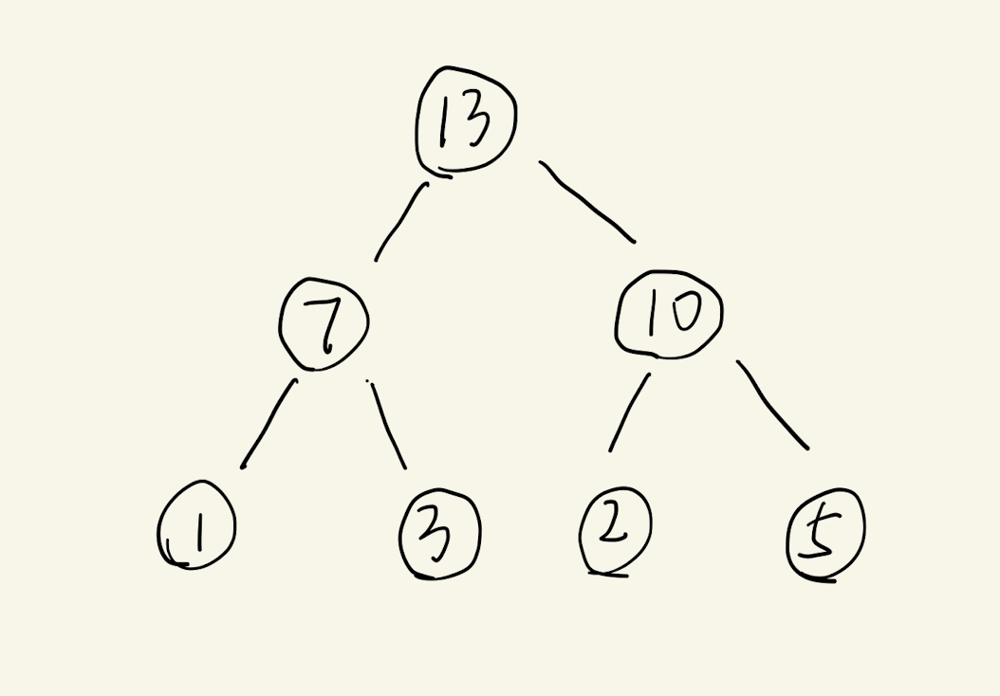
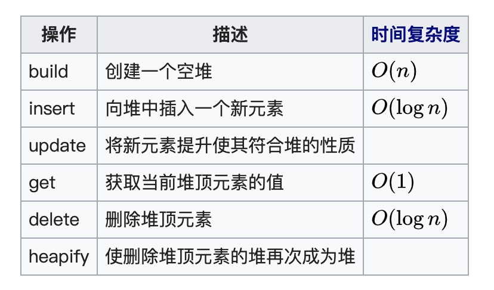

# 图文讲解堆排序
以前面试的时候碰到过问**堆**数据结构的，当时对数据结构了解太少，没能回答上来，可能因此错过了一次非常好的机会。从那以后一直在补基础知识，今天就全面总结一下堆以及堆的应用。这里你需要一些**树**数据结构的基础知识。

## 介绍数据结构-堆

把稻谷堆在地上就形成了堆，堆的结构非常清楚，上面小下面大，这样的堆称为小顶堆（又称作最小堆）。最小堆在数据结构中是这样定义的[父节点的值恒小于等于子节点的值，此堆称为最小堆，那么大顶堆就是父节点的值恒大于等于子节点的值](https://zh.wikipedia.org/wiki/%E5%A0%86%E7%A9%8D)。

堆是一种树状的数据结构，我们通常说的堆是一棵完全二叉树结构。堆只有两种类型，就是上面提到的最小堆和最大堆，下面我们以最大堆作为案例来说明堆的存储与操作。

## 堆的存储与操作
下面是最大堆的例子，每个父节点都大于等于子节点的值。最大的值自然就是根节点了。


由于堆是一种非常特殊的二叉树，而且还是完全二叉树（上面的例子是满二叉树），那么只需要使用数组就能存储整个树结构了。根节点放在数组的第二个元素位置（下标为1），这样的好处就是对于任意节点$i$，左子节点就是$2i$，右子节点为$2i+1$，父节点为$i/2$再地板取整。

```python
max_heap = [None，13, 7, 10, 1, 3, 2, 5]
```

存储的关键在于访问，通过上面这种方式解决了存储和访问以后，接下来要看堆有哪些操作了。我们能够想到的操作应该有：

* 插入一个新元素
* 获取根节点元素
* 将序列堆化（变成堆）

其实堆的操作大致也就这3种了。实际实现堆的过程中会更加细化这些操作。下面是参考wiki上的操作：

比如获取堆顶的元素（根节点）。首先拿到根结点，然后从堆中删除根结点，接下来将剩余的数据再次堆化。通过这些操作就完成了一次获取对顶元素的值。

## 堆排序
上面介绍了一些关于堆的基础知识，接下来就用堆进行排序了。**把一个序列从小到大进行排序，实际上只需要把这个序列变成最小堆，然后不断的从最小堆中获取根节点，就得到有序序列了**。听起来是不是觉得有点麻烦，但是实际的时间复杂度非常理想，是$o(n\log n)$。这得力于从堆化的数据中每次获取根节点，然后再次堆化的时i间复杂度是$o(\log n)$，对于问题规模n来说，完成所有的操作算法复杂度自然就是$o(n\log n)$了。

## 总结
堆数据以及堆排序的用处非常大，尤其是对于一个**动态的数据集**（不断添加新元素的数据集），每次获取根节点就更加便捷了。同时堆也可以作为一种优先队列（可以允许插队的队列），每次从对列中获取优先级最高的元素作为优先处理的对象。这种情况很常见，比如在操作系统的资源调度过程中，操作系统通常会处理优先级高的进程，而这些进程存储在优先队列中。

本文暂时不贴出堆的实现代码了，最麻烦的操作是**删除堆顶以后再次堆化**和**插入新元素的堆化**，实现两种操作的思路差不多。删除堆顶以后把最后一个元素放在堆顶，然后逐步与其子节点比较，这个过程叫向下筛选Sift Down（下沉）。而插入新元素，先放在最后，然后逐步与父节点比较，这个过程叫向上筛选Sift Up（上浮）。还是挺简单的。


