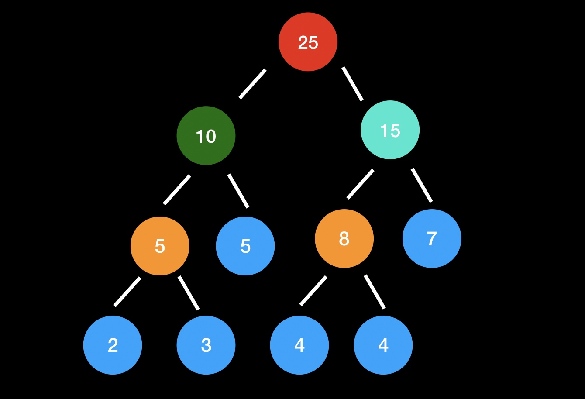
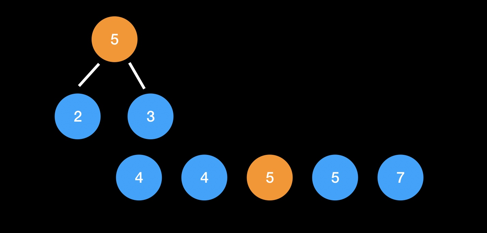
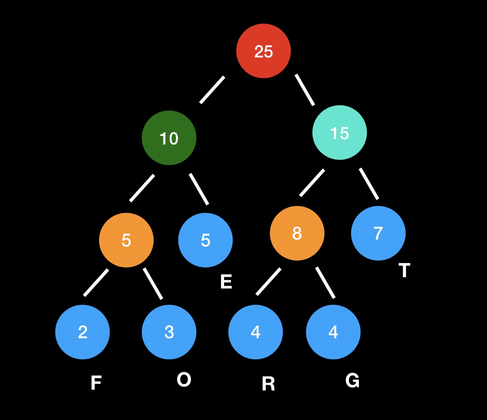

# 图文讲解Huffman树
本文通过图文介绍Huffman树的构成，重点在于理解Huffman树的形成原理，另外给出Huffman树的参考代码。之后通过文本压缩的例子来介绍Huffman编码，本文将从以下几个方面来介绍：

1. 什么是Huffman树
2. 案例介绍Huffman树的构成
3. Huffman编码
4. Huffman编码的应用

## 什么是Huffman树
Huffman树是一种树状的数据结构。任何一种数据结构都是用来解决特定的问题，那么首先我们先来弄出清楚Huffman树解决什么样的问题？



现在有一些不同数值的节点（图中蓝色），要把这些节点构成一颗二叉树，而每个节点所在的层数就是这个节点权重，现在要求构成的二叉树所有节点的加权之和要最小。直观上应该是节点数值越大的层数越小，也就是离根节点越近。

[霍夫曼树又称最优二叉树，是一种带权路径长度最短的二叉树](https://zh.wikipedia.org/wiki/%E9%9C%8D%E5%A4%AB%E6%9B%BC%E7%BC%96%E7%A0%81 "中文wiki霍夫曼编码")。所谓树的带权路径长度，就是树中所有的叶结点的权值乘上其到根结点的路径长度（若根结点为0层，叶结点到根结点的路径长度为叶结点的层数）。树的路径长度是从树根到每一结点的路径长度之和,记为:

$$ WPL =（W_1*L_1+W_2*L_2+W_3*L_3+ ...+W_n*L_n）$$

$N$个权值$W_i,(i=1,2,...n)$构成一棵有$N$个叶结点的二叉树，相应的叶结点的路径长度为$L_i,i=1,2,...n)$。可以证明霍夫曼树的$WPL$是最小的。

## 案例介绍Huffman树的构成
上面介绍完了Huffman树的概念，如何构造这棵树还是不清楚。根据直观的理解，应该先找到节点值最小的两个，构造成子树，这两个节点唯一能确定的是**层数肯定是最大的**，这两个节点之和作为的父节点值。



这个父节点可以作为这两个字节点的“代表”，放回原来的节点序列中，于是在找到最小的两个节点，同样的方式构成子树，将父节点放回节点序列中，不断重复直到完成原来节点序列为空。

上面的思路其实不难理解。先找到树的**层数（深度）最大的节点**，即便是层数不确定；子节点求和以后得到父节点放回去，然后再确定**层数不大于上一层的节点**，重复上述动作最终就能确定**最优二叉树**，详细参考下面的动图。


这里我们使用优先队列来实现Huffman树：

1. 把n个节点加入优先队列，则n个节点都有一个优先权Pi，1 ≤ i ≤ n
2. 如果队列内的节点数>1，则：
    ⑴ 从队列中移除两个最小的Pi节点，即连续做两次remove（min（Pi）,Priority_Queue)
    ⑵ 产生一个新节点，此节点为（1）中移除节点的父节点，权重值为（1）两节点之权重和
    ⑶ 把⑵产生的节点加入优先队列中
3. 最后在优先队列里的点为树的根节点（root）

## Huffman编码
[霍夫曼编码（英语：Huffman Coding），又译为哈夫曼编码、赫夫曼编码，是一种用于无损数据压缩的熵编码（权编码）算法。由美国计算机科学家大卫·霍夫曼（David Albert Huffman）在1952年发明](https://zh.wikipedia.org/wiki/%E9%9C%8D%E5%A4%AB%E6%9B%BC%E7%BC%96%E7%A0%81 "中文wiki霍夫曼编码")。

回到上面的例子，得到了Huffman树，从根节点到叶节点的路径分为左右两个方向，**向左记为0**，**向右记为1**，于是叶节点的Huffman编码就是从根到叶节点的路径编码。



每个叶子节点是对应字母的频数，于是就可以对每个字母进行Huffman编码了。可以看到字母“F”的编码为“000”，字母“G”的编码为“101”。所有待编码的数值放在叶子节点，**这样的好处是不存在前缀编码的问题**，在解码过程中不会存在歧义。现在对Huffman编码应该理解了吧。接下来看一个在数据压缩方面的应用。

## Huffman编码的应用
我们随便找来一段英文

> These are some books I recommend reading. I read mostly science fiction and fantasy; it's a fundamental pillar of my personality. Unfortunately, it's hard to get people to read that stuff, so I've kept this list pretty broad. Enjoy, and let me know if you liked (or hated) any!They're roughly in order of influence.

现在需要对这段英文进行编码存储，当然占用空间越小越好。我们采用ascii的思路对这段英文进行编码，先来统计这段文本中字符的种类和个数。

```python
from collections import defaultdict

def count_ch(s: str):
    """计算字符的种类和长度"""
    char_dict = defaultdict(int)
    for ch in s:
        char_dict[ch] += 1
    return len(char_dict), sum(char_dict.values())
# 35 315
```
35种字符需要使用6个位进行编码（$2^6 = 64$），一共315个字符，每个字节有8位。那么315个字符至少需要字节数为$315 \times 6 / 8=237 $byte(向上取整)。

上面是固定长度的编码方式，而Huffman编码是不定长的，频数越高的字符编码长度越短，理论上要比定长字符节省空间。首先针对这段文本获得Huffman编码，实现代码使用[huffman模块](https://pypi.org/project/huffman/)

```python
from huffman import huffman
from collections import Counter

def get_huffman_code(s: str):
    c = Counter(s)
    return huffman.codebook(c.items())

if __name__ == '__main__':
    code_book = get_huffman_code(content)
    huffman_encode = ""
    for each in content:
        if not code_book.get(each):
            raise ValueError(code_book.get(each))
        huffman_encode += code_book.get(each)

    print(len(huffman_encode) / 8) # 总的占用位数 / 8 = 字节数
# 173.625
```
给出几种字符的Huffman编码：

```
'T': '10111111'
'h': '00000', 
'e': '001', 
's': '11011',
'a': '0111'
```

根据上面得到的Huffman编码表对原文进行编码，然后计算占用字节数为174byte。假定两种编码在解码是前缀编码占用存储一致这里暂时忽略不计，那么Huffman编码相比于ascii等长编码来说，占用存储减少了23%。

## 总结
本文从四个方面介绍Huffman树以及Huffman编码的应用。重点在于理解Huffman树的原理，至于实现Huffman树代码，可以作为训练编程能力的题目。其算法的实现过程并不复杂，有多种实现方法。

Huffman编码的应用非常广泛，文件压缩、图片压缩都会用到，解压以后数据与原数据一致，因此还是一种无损压缩算法；通过上面的例子也发现了，Huffman编码与等长编码相比明显存在优势。希望读者理解并掌握这种数据结构。


