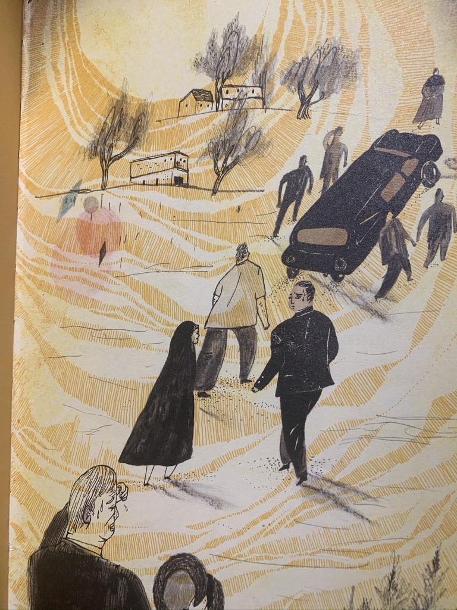
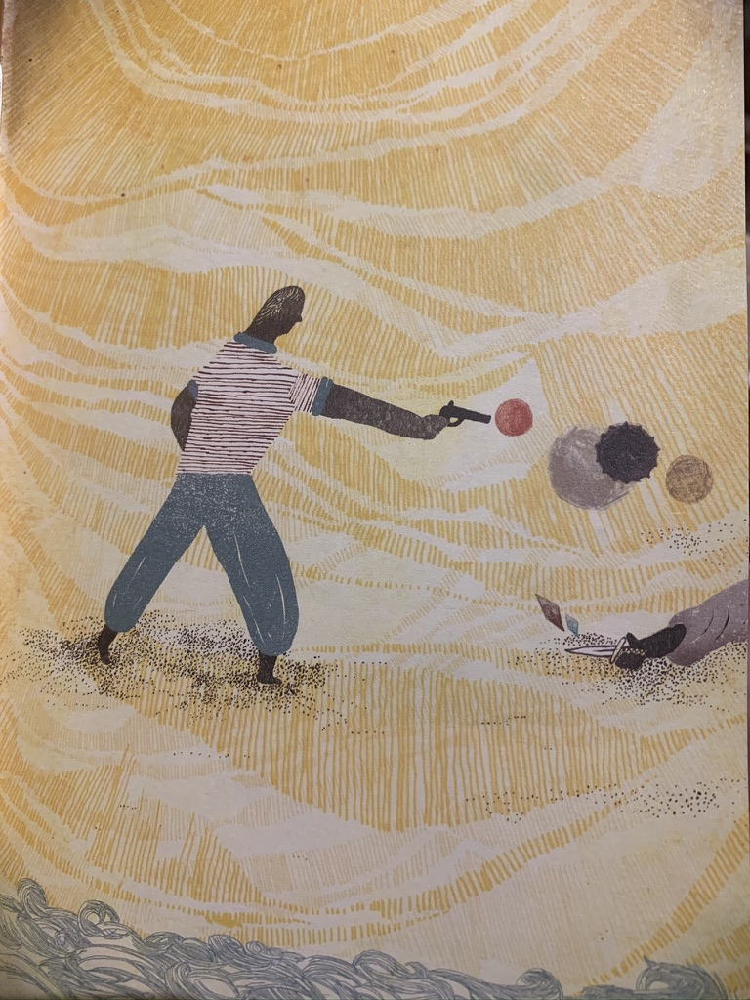

# 最近读了加缪的《局外人》
加缪（Albert Camus），“存在主义”文学大师，“荒诞哲学的”代表作家。法国著名作家、哲学家、文学理论家。1942年他凭借《局外人》一举成名，并于1957年获得诺贝尔文学奖。加缪的作品始终从现实生存困境出发，揭示了世界的荒诞性。他主张人类要直面荒诞，并且在荒诞中奋起反抗。

《局外人》这本小说很短，全文仅仅120多页内容，翻译也很流畅。本文采用第一人称作为故事主人公，带入感极强，以至于读完小说还不记得主人公叫什么名字😓。故事也很简单，内容分为两个部分，第一个部分六节，第二个部分五节。接下来简单介绍了大致内容：

第一部分主要两个事情，安葬母亲和“意外”杀死了一个阿拉伯人；第二部分被捕以后接受审判。你是不是不敢相信，这么简单的小说。看完以后内心有点沉重，似乎好的作品都不会让你舒服地读完。像主人公莫尔索这样的人，真的存在吗？

**今天，妈妈死了。也可能是昨天，我不知道。我收到养老院的一封电报，说：“母死。明日葬。深致哀悼。”这说明不了什么。可能是昨日死的。**

开篇的第一段话，基本上勾勒出了莫尔索是一个非常冷漠的人，冷漠到对母亲的过世似乎没有任何感情。接下来养老院的院长两次询问他是否要看最后一眼，莫尔索是拒绝的，在最后盖棺的时候，莫尔索仍然拒绝看最后一眼。甚至连他自己也不知道为什么要这样做。送葬的路上有人问起来他母亲多大年纪了，莫尔索也不知道，仿佛这一切都跟他没有关系一样。

**我转身，看到老贝莱兹在我们身后五十米额度地方。他手里摇晃着软毡帽......。我周围仍然是一片被阳光照的发亮的田野。天空亮得让人受不了。沥青在太阳的暴晒下爆裂开来，脚一踩就陷了进去，留下一个个裂口，上面还有泥浆油光发亮。**

送葬变成了一件机械性的任务，似乎找不到任何拒绝的理由，只能被动的接受这一切。终于完成了送葬的仪式，回到巴黎还是周末，于是决定去游泳，刚好在游泳馆碰到了他还未来得及勾搭的对象玛丽，当晚看了喜剧电影并且还发生了一夜情。

在海滩游泳时与几个阿拉伯人发生了冲突，最终枪杀了一个阿拉伯人。**我感觉天门洞开，烈火如雨，倾泻而下。于是，我又对准那具已经了无生气的肉体开了四枪，就像是我在苦难之门上，急促地叩了四下。**

最终接受审判时，莫尔索也没有请律师。法庭指派的律师也被他气走了。理由是律师告诉莫尔索，要按照他说的回答，保证胜诉是没有问题的，莫尔索觉得这样没有任何意义。很明显这样的人，审判的结果毫无疑问是上断头台。牧师希望莫尔索做最终的忏悔，以得到上帝的宽恕，莫尔索义正言辞地拒绝了。

我个人觉得小说的荒诞性体现在两个方面。第一人物的荒诞，主人公莫尔索毫无疑问是荒诞的，如此冷漠地对待自己的母亲，不知道为什么一定要看最后一面，最终选择了沉默。对于女朋友玛丽的态度也是“我都可以”，完全的无所谓的态度，但实际上莫尔索似乎也是爱玛丽的，到底只是一种肉欲的满足还是真诚的爱，也不清楚，似乎都不重要。

在莫尔索的世界里，没有重要的事情，甚至于自己的生命，“三十岁死和六十岁死又有什么区别呢？”。在现实中，莫尔索是一个被社会边缘化的人，被动地接受着一切。他与这个世界无关，就想做一个局外人，可能连“想”都没有想。

第二就是世界的荒诞。排除了莫尔索以外的人组成的世界，他们有的人制定规则，有的人遵守规则。对于不遵守规则的人，将会被踢出局（变成局外人）。最明显的就是在审判莫尔索时，检察官解读他的“灵魂”。莫尔索是一个沉默寡言的人，对待自己母亲的死亡都非常冷漠，没有表现出一点悲伤；第二天还去游泳看喜剧电影，之后还发生一夜情；交的朋友也是不务正业的；打架斗殴杀了人，还对着尸体残忍地又开了四枪。这些标签累计起来就是十恶不赦的罪人。

莫尔索身上体现着浓浓的虚无主义，这是怀疑主义的极致形式，认为世界、生命（特别是人类）的存在都没有客观意义的。明白了虚无主义，你也能理解莫尔索的种种行为，他其实算不上坏人、恶人，长期被社会边缘，躲在某个角落里，觉得存在没有任何意义。连撒谎也没有必要，他解释为什么向尸体又开了四枪，因为天气太热很烦躁，而陪审团的反应是哄堂大笑。

有兴趣的可以读读小说，也许你能读出更多味道来。小说中有非常多的细节去诠释虚无主义，本文无法一一罗列。（题外话：读小说中的人物很有意思，往往都是作者构造的出来的。假如现实中存在100种性格，那么理论上应该有$2^100$种人，可以读出与现实中相近但又不同的人。）