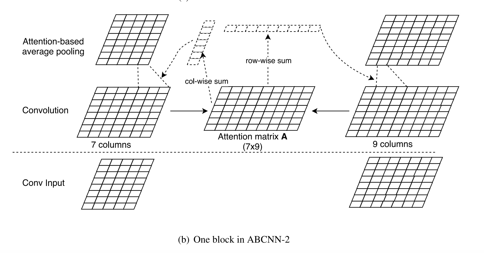

# NLP论文笔记
本文整理个人读论文的一点心得，分享其中有意思的论文观点，主要作为学习笔记，如果能够对读者有帮助，那就更好了。

本文主要关注注意力机制。[注意力机制最早在2014年出现在CV领域](1 "Mnih, V., Heess, N., Graves, A., & Kavukcuoglu, K. (2014). Recurrent models of visual attention. Advances in Neural Information Processing Systems, 3(January), 2204–2212.")，之后[Bahdanau，Bengio等人将这种机制运用到自然语言处理领域](1 "Bahdanau, D., Cho, K. H., & Bengio, Y. (2015). Neural machine translation by jointly learning to align and translate. 3rd International Conference on Learning Representations, ICLR 2015 - Conference Track Proceedings, 1–15.")，开创了基于注意力机制刷榜NLP各类任务的时代。既然注意力机制这么牛皮，那为什么不直接使用呢？于是[Vaswani,Shazeer,Kaiser等人](1 "Vaswani, A., Shazeer, N., Parmar, N., Uszkoreit, J., Jones, L., Gomez, A. N., Kaiser, Ł., & Polosukhin, I. (2017). Attention is all you need. Advances in Neural Information Processing Systems, 2017-Decem(Nips), 5999–6009.")直接抛弃了RNN，提出了自注意力机制，这就是后来的Transformer架构。之后沿着Transformer这条路发展的预训练模型就一发不可收拾了。

Bahdanau等人最早引入了注意力机制，采用的是双向RNN作为编码层，解码层采用单向的RNN。既然RNN可以添加注意力机制，那么CNN应该肯定也可以（NLP领域使用CNN）。

## ABCNN基于CNN的注意力
ABCNN（Attention-Based Convolutional Neural Network），[2018年Wenpeng Yin, Hinrich Sch¨utze等人做了尝试](1 "Yin, W., Schütze, H., Xiang, B., & Zhou, B. (2016). Erratum: “ABCNN: Attention-Based Convolutional Neural Network for Modeling Sentence Pairs.” Transactions of the Association for Computational Linguistics, 4, 566–567. https://doi.org/10.1162/tacl_a_00244").做的是Answer Selection(AS)、Paraphrase Identification(PI) 以及 Textual Entailment(TE) 这3个任务，输入的都是句子对。

文中提出了3种模型，分别是ABCNN-1， ABCNN-2，ABCNN-3，作为对比的模型有BCNN（无注意力机制的CNN），以及一些baseline模型。接下来逐个看提出的3种模型。

### ABCNN-1
红色矩阵是经过两个句子经过word Embedding得到的特征层，下方蓝色的矩阵是Attention层映射得到的注意力特征层，红色和蓝色做拼接，作为卷积层的输入。之后的卷积池化最终喂入LR层，这些操作与BCNN一致，具体网络图读者可以看原文。

跟BCNN唯一的不同在于，增加了attention的映射层，多了一些特征。而BCNN的过程是完全独立处理两个句子，相对BCNN来说，效果肯定会好。

### ABCNN-2

ABCNN-2在BCNN基础上做了改进，输入与ABCNN-1不同的是，ABCNN-2是在卷积层输出以后，两个矩阵做Attention，得到的矩阵A，然后对A矩阵分别做col方向和row方向求和，得到了两个系数向量，之后再与卷积输出层做加权喂入到池化层之后的操作与BCNN相同。

### ABCNN-3
ABCNN-3整合了前面两个模型的Attention操作，具体网络图如下：

文章的重点在于尝试把注意力机制放在CNN上，其实CNN在自然语言上使用的不是很多。尤其是对于长句子CNN很难学到上下文的特征，不说CNN，就连擅长处理序列的RNN变体也很常常会“记忆力”衰退。实验结果也证明了相对于单层的LSTM来说，指标的提升不超过5%。

## 分数阶梯度下降算法
梯度下降算法是神经网络常用的优化算法，目前的优化算法几乎都是梯度下降的变体算法。然而这种算法常常会陷入到局部最优解，如果目标函数是凸的，则局部最优解就是全局最优解。

[阚涛等人](1 "Tao, K., & , GAO Zhe, Y. C. (2020). 采用分数阶动量的卷积神经网络随机梯度下降法. 模式识别与人工智能, 33(6).")采用分数阶求导的方式代替原来直接求梯度的方式，作为一种新的计算梯度的方法，计算方式相对复杂一些，实验的结果表明，与经典的梯度下降算法没有太大的差异。但作为一种新的优化算法还是有意义的。

