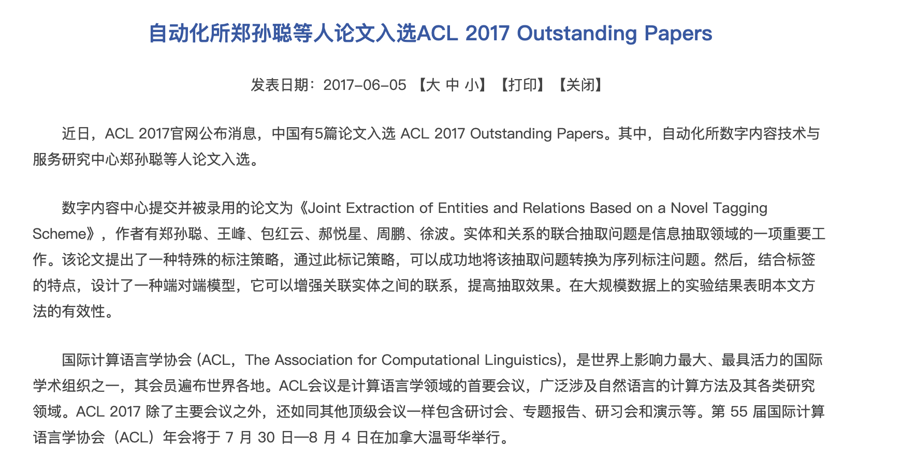
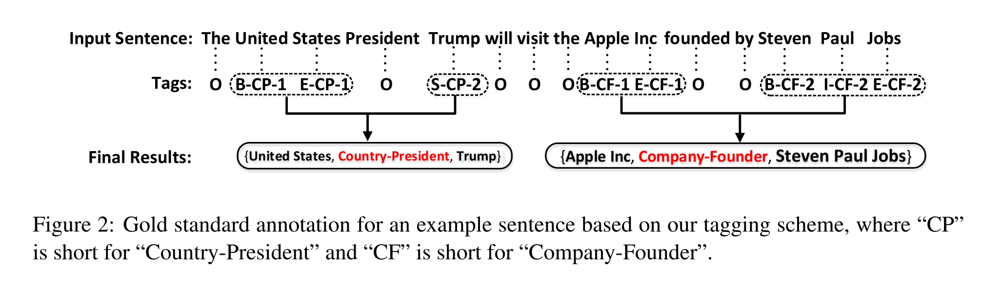
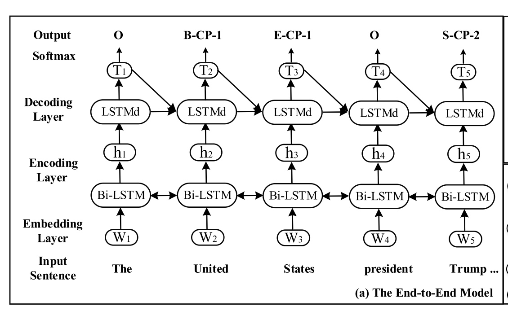

# NLP论文笔记-新标签的关系抽取
之前写过一篇公众号，介绍在没有参考中科院专家论文情况下，我在项目中也使用了类似思路。本文就重点介绍一下这篇论文《Joint Extraction of Entities and Relations Based on a Novel Tagging Scheme》，[2017年由中科院团队发表](1  "Wang, S., Zhang, Y., Che, W., & Liu, T. (2018). Joint Extraction of Entities and Relations Based on a Novel Tagging Scheme. IJCAI International Joint Conference on Artificial Intelligence, 2018-July, 4461–4467. https://doi.org/10.24963/ijcai.2018/620")的论文，当时被评为年度杰出论文。

## 关系抽取简介
**实体**（Entity）的**关系抽取**（Relation Extraction）作为NLP领域的一项基本任务，很早就被学者关注到了。早期的实体识别通常基于**概率图**模型，如**隐马尔可夫链**（Hidden Markov model，简写 HMM），**条件随机场**（Conditional random field， 简写CRF），实体识别完成以后再进行实体的关系分类，这就是早期使用的**Pipline**方法，也称为流水线式的抽取方法。这种方法在今天仍然发挥很大的作用。

另一种方式就是Joint Model方法，一个模型完成多个任务，包括**实体识别**和**关系分类**两个任务，底层使用参数共享的方式，很好地做到了端到端（end to end）处理方式，并且取得了非常好的效果。

## 论文介绍
本文最大的贡献是通过定义一种新的标签集，将Joint Model任务转化为序列标注问题，也就是实体识别。关键是把关系定义到标签里。可以参考原文：

 > We design a kind of novel tags which contain the information of entities and the rela- tionships they hold. Based on this tagging scheme, the joint extraction of entities and relations can be transformed into a tagging problem

来看一下论文中提出的标签策略，实体**United States**标签本来应该是B-ORG E-ORG，修改为**B-CP-1 E-CP-1**，而实体**Trump**应该是S-PER，修改为S-CP-2.实体标签里已经包含了关系CP（Country-President）关系。
 

通过上面的作为，只要完成序列标注问题，实体的关系也就完成了。

## 论文的网络结构
本文是在2017年发表，当时处理序列问题流行的仍然是LSTM，下面是编码器和解码器的网络图。

可以看到编码器采用双向的LSTM获取输入的序列特征，解码器使用单向LSTM，并且将上一个输出标签也作为下一个标签的输入，这个点非常重要，因为标签的之间的关系是非常重要的特征。最终输入到softmax层。

## 论文的一点想法
本文最大的贡献肯定是新标签的提出，将两个任务转化为一个任务，代价是标签的种类增多了，如果在特定领域内或者关系种类较少的情况下，这样的做法简单有效，但是对于开放域，关系较多的情况下，使用这种方法，最终关系分类会进一步增加，效果也有待实验验证，个人觉得效果也不会太差。

论文同步更新在个人博客：http://blackedu.vip
微信公众号（**数学编程**）以及CSDN（**数学编程**）上，欢迎关注我。
