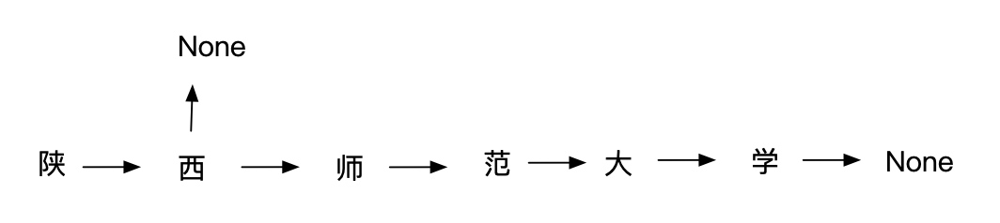
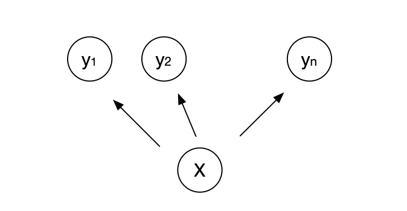
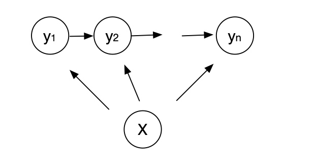

# 中文分词模型
最近一段时间没有更新文章了。忙着在家带孩子和找工作这两件事，有点焦头烂额了🤪，忙得差不多了，还是继续写点东西。本文将构建一个神经网络模型实现中文的分词。

## 介绍
中文分词任务就是解决这样的任务，比如：

```
我毕业于陕西师范大学物理系
```
分词的结果为:
```
我 毕业 于 陕西师范大学 物理系
```
顾名思义，分词就是把一段文本中的词语分割开，看起来是不是很简单呢。顺其自然的思路是定义一个**汉语词典**，每次分词的时候都去查词典，这样就能完成分词了。

如果你能想到这里，恭喜你，对于登录词基本都是这么做的，不过很多时候词会包含关系。比如说“陕西师范大学”是一个词，而“陕西”也是也一个词，这种情况怎么办呢？技术上是将词典构建成**前缀树**，每次扫描文本的下一个词，看是否能在前缀树中找到，前缀树长这个样子。



每一个字嵌套一层Map（Python中称为字典），当“西”后面只有接“师”才能继续往下，否则得到None，就返回“陕西”这个词了。如果把常用的词都建成这样的前缀树，是可以满足基本的分词任务的，不过这种情况对于词典没有定义的词，会得到很奇怪的分词结果，对于未登录词，通常采用隐马尔可夫模型（可以参考结巴分词），之前的文章有介绍这个模型，这里不在赘述。接下来看神经网络如何解决这个问题。

## 中文分词任务
中文分词任务通常被定义为序列标注问题，输入文本等于标签的长度一致，也就意味着逐字标记。通常标签的定义有2Tag、4Tag、6Tag，最常用的是4Tag的标签，分别是B、M、E、S 分表表示词的开始、中间、结束、单个词。例如：

```
我毕业于陕西师范大学物理系
SBESBMMMMEBME
```

通过解读标签，就能得到分词结果。“S/BE/S/BMMMME/BME”，对于的分词是“我/毕业/于/陕西师范大学/物理系”。

## 构建模型
对于输入序列X（就是待分词的文本），输出为标记序列（标签）。本质上是求$p(Y|X)$条件概率，使得这个条件概率最大时对应的输出序列Y。

如果每个标签是独立，也就是说$y_i$与$y_j$是无关的，这个条件概率就可以写成：

$$p(Y|X) = p(y_1,y_2,...,y_n|X)=\Pi_i^N p(y_i|X)$$

对应的结构见下图，这就是softmax解码，本质上是就是逐词的分类问题(Token Classification)。



上面的模型忽略了一个问题，标签并不是独立分布的，而是依赖上下文标签的。比如待分词的文本，第一个字只有可能是S或者B标签，不可能是M或E标签，B标签之后只能是M或者E标签，不能是S或者B标签。也就是说标签之间存在转移概率，我们把这个因素考虑进去。

总结一下上面的内容，标签构成线性链，并且服从马尔可夫性，于是这个概率图就简化为一个线性的条件随机场。对应的概率图如下：



关于条件随机场的内容，下次再详细介绍，内容会涉及大量公式，感兴趣的读者可以去了解。

下面给出keras构建模型的代码：
```python
from tensorflow.keras import Input, Model, Sequential
from tensorflow.keras import layers as L

CRF = ConditionalRandomField()

vocab_size = len(tokenizer.token2id)

cnn = Sequential([
        L.Embedding(vocab_size + 1, 100),
        L.Conv1D(filters=128, kernel_size=3, padding='same', activation='relu'),
        L.Conv1D(filters=128, kernel_size=3, padding='same', activation='relu'),
        L.Conv1D(filters=128, kernel_size=3, padding='same', activation='relu'),
        L.Dense(5, activation='softmax'),
        # ConditionalRandomField()
    ], name='cnn')
cnn.summary()
x_in = Input(shape=(None,))
x = cnn(x_in)
out = CRF(x)
model = Model(x_in, out)

model.summary()
```

解释一下这里使用4Tag，结果是输出5分类这个问题，这是因为对标签序列需要做padding，以保证每个batch的shape是相同的。

使用了CRF层，解码的时候需要使用**维特比算法**，这里使用苏剑林的bert4keras模块，感谢作者的开源项目。

```python
from bert4keras.snippets import ViterbiDecoder
from typing import Union

class WordCutDecoder(ViterbiDecoder):
    def recognize(self, text: Union[str, List[str]]):
        """text 是char级别的list或者str"""
        encode_text = [tokenizer.token2id.get(w, 0) for w in text]
        nodes = model.predict([encode_text])[0]
        labels = self.decode(nodes=nodes[:, :-1])
        tags = [id2tag.get(i) for i in labels]
        return labels, tags

decoder = WordCutDecoder(model.get_weights()[-1][:-1, :-1], starts=[0,3], ends=[2,3])
```

模型预测的时候使用维特比解码，得到标签，解析标签就能得出最终的分词结果，我写了一个**simple_cut**方法供参考，下面是几个分词的结果：

```python
" ".join(simple_cut('我本科毕业于陕西师范大学，毕业以后一直在深圳从事互联网工作'))
# '我 本科 毕业 于 陕西师范大学 ， 毕业 以后 一直 在 深圳 从事 互联网 工作'

" ".join(simple_cut('基于深度学习的信息抽取技术集散地,欢迎大家关注'))
# 基于 深度 学习 的 信息 抽取 技术 集散地 , 欢迎 大家 关注

" ".join(simple_cut('不知道这个玩意到底,怎么样?'))
# 不 知道 这个 玩意 到底 , 怎么样 ?
```

详细的代码可以在我的GitHub上看到。