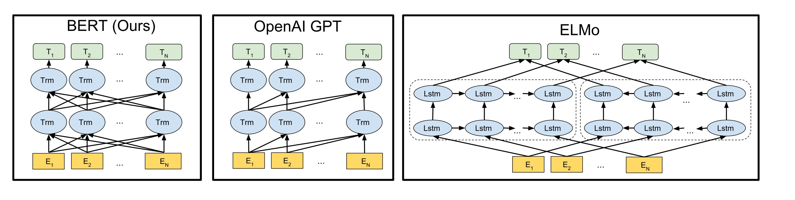
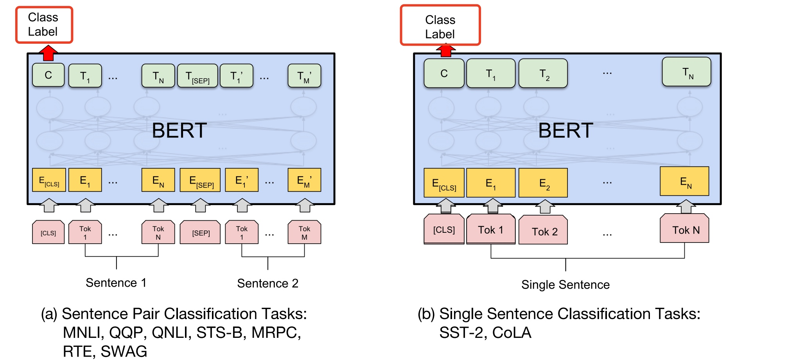
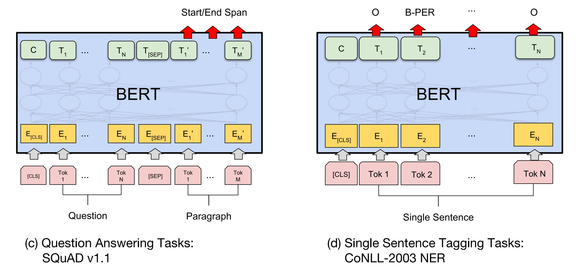
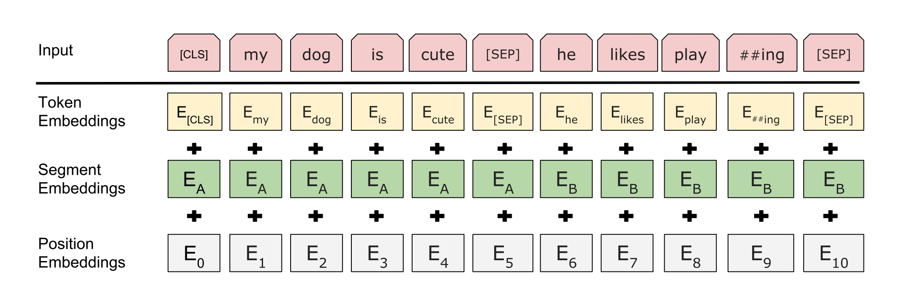
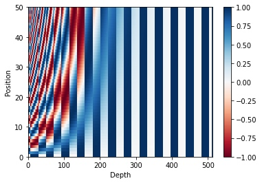
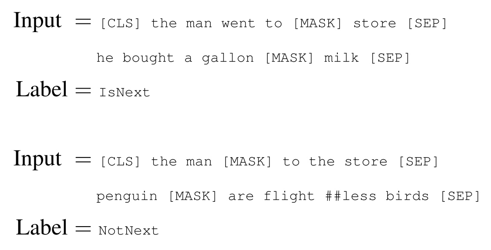

# Bert论文笔记
做了挺多NLP的任务，对于很多模块的原理都是通过看资料和论文，实践也是调用别人写好的模块（说明开源分享太好了😍）。纸上得来终觉浅，最近根据论文写了Transformer模块，还是花了挺多时间，看来要多动手，切勿纸上谈币。

已经多次读Bert论文了，每次读论文都会发现一些新的东西，可能是由于以前的基础较弱，很多细节看得不是很明白，我相信很多初学者肯定也会有类似的疑惑，这篇文章写给对Bert有兴趣的读者。

本文较长，会从以下几个方面介绍论文，算是自己的笔记了。
1. 网络结构介绍
2. 编码方式
3. Embedding的处理
4. 预训练的任务
5. 如何预训练

## 网络结构介绍

BERT（**B**idirectional **E**ncoder **R**epresentations from **T**ransformers）是基于双向的Transformer Encoder来提取全文特征，Transformer的特点在之前的文章有介绍过。下图数Bert与别的预训练模型的架构对比。Bert使用的是双向的Transformer，而Open GPT 采用的是从左到右的方式，也就是下一层的编码是依赖上文的信息，ELMO则直接使用两块独立LSTM提取特征，最终拼接起来。

## 编码方式
我们知道计算机无法直接处理文本信息，通常会讲文本转为数据，就需要对文本进行编码。Bert编码有两个要点：

1. 引入特殊符号[CLS]、[MASK]和[SEP]
2. 采用WordPiece的方式

[CLS]符号用于每个句子的开始，[SEP]用于句子结束和句子之间的分隔符。[Mask]符号放在预训练任务中。

要说清楚[CLS]符号作用，必须理解到Bert模型的本质。Bert使用了多层Transformer的Encoder，**本质上与Embedding做的事情是一样的，或者可以把Bert理解成深度的Embedding**，因为输入数据的shape是[batch_size, seq_len], 输出维度是一样的都是[batch_size, seq_len, hidden_dim]，只不过Bert通过多层的Attention，更多的捕捉到序列的上下文特征。

既然Bert最终输出的shape是[batch_size, seq_len, hidden_dim]，对于一些分类问题，我们只需要[batch_size, 0, hidden_dim]就可以了，就是[CLS]的输出矩阵，所以这个标签就是分类标签，而对于其他序列问题，则忽略这个标签的输出。

**WordPiece顾名思义就是把单词分片**。英文单词往往存在多种形式，如过去式，动名词形式，或者加er、or等等，通过wordPiece分片处理不仅有效的减少了单词个数，而且更容易保留单词的语言信息。否则按照token直接编码同一个单词的不同形式将会编码成不同单词。

## Embedding的处理
Bert输入有3种Embedding，分别是Token Embeddings、Segment Embeddings和Postion Embeddings。

其中Token Embeddings是将词索引变成词嵌入层，Segment Embeddings表示输入句子的归属，如果是单个句子输入全部是0，如果是句子对输入，第一个句子为0，第二个句子为1。而Postion Embeddings是绝对位置的向量，这里采用正余弦计算[^1]

$$
PE_{(pos, 2i)} = \sin(pos / 10000^{2i / d_{model}}) 
$$

$$
PE_{(pos, 2i+1)} = \cos(pos / 10000^{2i+1/d_{model}})
$$
其中$pos$表示词在序列中的位置，$i$表示特征方向的维度，偶数位置采用正弦，奇数位置余弦。这样做的好处容易学到相对位置的信息，因为对于任意固定的$k, PE_{pos+k}$都可以写成$PE_{pos}$的线性组合，会想一下高中三角函数的公式就理解了。

$$
PE_{(pos+k, i=偶数)} =\sin(pos/ \phi+ k/\phi) =\sin(pos/\phi)\cos (k/ \phi)+ \cos(pos/\phi)\sin(k/\phi)
$$
下面是序列长度为50，输出512个特征的position embedding的图。

## 预训练的任务
预训练就是预先训练，Bert的训练的两大任务分别是Masked Language Model（MLM）和Next Sentence两个自监督任务。下面来介绍这两个任务怎么做的，以及为什么要这么做。

MLM的做法是对一个Batch中15%的单词进行遮挡。对这15%的句子处理分3中情况：
1. 80%的情况下直接mask。比如 my dog is hairy → my dog is [MASK] 
2. 10%的情况下随机填充mask位置的词。比如my dog is hairy → my dog is apple
3. 10%的情况下保持不变。my dog is hairy → my dog is hairy

通过对句子进行遮挡，然后预测这个单词，这样做是为了让模型能够学到Token级别的上下文信息，另外的Next Sentence任务就是为了让模型学到句子级别的特征。Next Sentence的任务非常简单了，替换文本的下一个句子，然后预测这两个句子是不是Next Sentence关系。通过对50%的数据进行替换，来完成分类任务。

通过上面两个任务的训练，模型可以很好的学到单词和句子级别的特征，将训练得到的权重作为新任务的初始权重，然后使用很小的学习率进行微调，以满足不同任务需求，这就是预训练的fine-tuning。

## 如何预训练
上面已经基本上介绍了Bert的很多细节，包括训练该怎么操作，感兴趣的读者可以阅读原文[^2]，以及原文的源代码（这么有名的项目非常好找）。关于如何训练Bert模型这里有一篇复旦大学的论文[^3] 

[^3]: "Sun, C., Qiu, X., Xu, Y., & Huang, X. (2019). How to Fine-Tune BERT for Text Classification? Lecture Notes in Computer Science (Including Subseries Lecture Notes in Artificial Intelligence and Lecture Notes in Bioinformatics), 11856 LNAI(2), 194–206. https://doi.org/10.1007/978-3-030-32381-3_16"

[^1]: "Vaswani, A., Shazeer, N., Parmar, N., Uszkoreit, J., Jones, L., Gomez, A. N., Kaiser, L., & Polosukhin, I. (2017). Attention Is All You Need. Nips. https://doi.org/10.1017/S0952523813000308"
[^2]: Kenton, M. C., Kristina, L., & Devlin, J. (2017). BERT: Pre-training of Deep Bidirectional Transformers for Language Understanding.

[^2]: Kenton, M. C., Kristina, L., & Devlin, J. (2017). BERT: Pre-training of Deep Bidirectional Transformers for Language Understanding.

