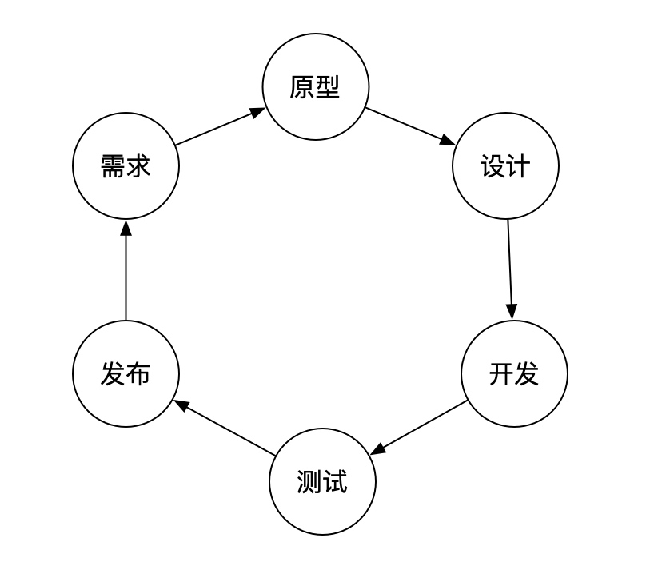
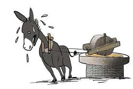

# 互联网公司为什么要996
最近已经被PDD的加班猝死的新闻刷屏了，已经超越“996福报”了，最长工作时间可以到30多个小时，意味着什么呢？意味着一天一夜不睡觉外加一个公务员一天的工作量。

最近对资本家的骂声已经够多了。我也从事互联网行业几年了，也想说说我的一点想法，来看看互联网行业为什么总是要加班。我总结了以下几个原因：

## 不合理的劳动分配，技术领导有问题
某大佬总结了一句很有代表性的话“5个人的活，招3个人，给4个人的钱”，这样既省钱又让人更加卖力的干，不是一举两得吗。在这个层面上只计算成本账，并没有考虑到劳动分配上，更深层的原因是领导，尤其是技术领导没有很好的评估工作量和个人能力，盲目求快导致欲速不达。

有经验的技术领导应该评估完工作量，然后制定工作计划，委派给团队完成。关键就在这里，有多少技术领导具备这样的领导能力呢？技术领导一定是**技术大牛加上有领导才能的人**，而不是只会贯彻执行上级领导的任务。否则他不清楚下面的人做什么，一味的追求最终结果，就是做不出来那就加班做，所有人都加班。

## 串行闭环的协作方式
串行闭环的协作方式，并且高度依赖协作。并行的做事，比串行的效率高得多。比如写一本书（小说除外），很多独立的章节可以安排多个人同时写，最终整合在一起就可以了。而互联网的产品研发恰恰就是这种串行的方式，而且还高度依赖串行协作。

串行闭环的协作方式是指从需求-产品原型-设计-开发-测试-完善需求，这里又回到需求了，形成了一个闭环。**往往需求变更是最频繁发生也是最头疼的事情**，有经验的工程师虽然会提前考虑应对这种需求变更，但所做的也很有限。

上面只是提到完成一个版本的需求，互联网的产品需要不断的更新迭代，推出新的功能，收集更多的需求，意味着在上面的圆不断地循环。

## 竞争激烈，行业内卷
看最近十几年来互联网的发展，从最初门户网站，到网站开发，到app应用开发；从大数据到云计算，人工智能，这些技术的发展。技术的初期缺口非常大，简单培训几个月出来的抢着要，随便拿到远超过平均收入的薪资。

现在没有那么容易了，大环境是整体经济下行，又碰上2020年的新冠影响，形成了**“僧多粥少”**的局面。劳务方竞争非常大，你不996大批的人等着996呢，于是打工人不仅失去了定价权，连不加班的权利都没有。

很多时候真的需要加班吗？以我看到的来说，并不是。“面向老板编程“你会吗？很多时候就是这样，**老板需要一种大家都在奋斗的感觉**。以前我在某公司，领导就直接告诉我们，每周至少需要加班2-3次，哪怕没事做看看技术资料也要加班。事实是平时的工作都不多，你不仅不能说，而且还要演出一副工作很饱和的样子😂。

## 制度法规不完善
劳动法我们是有的，但为什么互联网的老板们敢堂而皇之地执行996，并且公开表示“996福报”呢。来分析一下资本方、劳务方和监管方的心理很有意思。

互联网的休息日很有意思，排名先后为：双休日>大小周>单休>超级大小周>月历日。就一个正常的休息都能搞出那么多名词来。冰冻三尺非一日之寒，资本方也是逐步蚕食打工人的权利的。资本方心理很简单，慢慢吃，还不给钱，给正常工资的才叫加班。

那么劳务方为什么不反抗呢，不是有劳动法吗？是的，你会去举报你的公司加班吗？就算你举报了，公司赔点钱把你裁了，最终吃亏的还是你，要是还上了新闻，以后哪个公司还聘用你。于是打工人只能选择“要么干，要么滚”。至于监管方嘛，劳务方不来维权，我没法处理。想要我监管方主动去查，那是不可能的。

就算碰上了劳动纠纷，个人也没有那么多时间和精力跟公司耗，某为的215事件，要不是当事人远程备份了证据，也只能认栽了。没有工会组织帮你维权，并且提供法律援助，个人的力量太有限。

## 最后
说了那么多现实问题，只能说现实太残酷，这就是大环境，我们这一代人处于这样的历史背景下，个体是很无力也很无奈的，就如同生活在抗战年代的人们，他们无法选择时代。你只有改变自己。比如工作实在劳累了，辞职也要休息，哪怕以后没有高薪了，身体才是最重要的，更不要选择轻生来告别世界。

说到最后还是想提一点，大国情决定了民营企业也不容易，挣钱的行业基本都被国有垄断了，留在剩余的狭缝中竞争，谁比谁又会好多少呢？