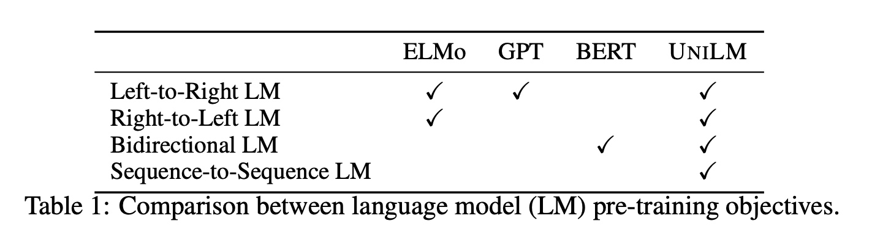
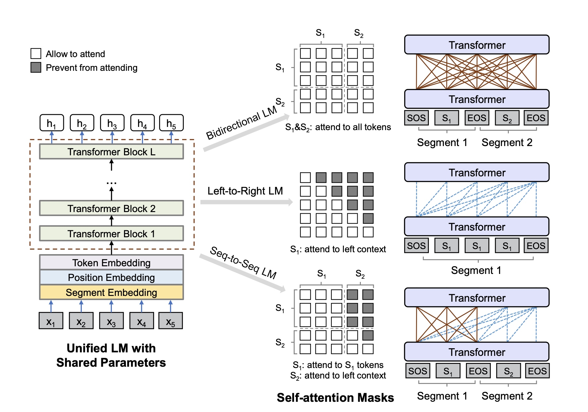

# AI版“对穿肠”
2018年看到有人开发了对联的深度学习模型，看起来效果也不错。“对下联”这个任务对于NLP来说，算是文本生成问题，典型seq2seq的模型。早期的模型普遍采用*encoder-decoder*架构，编码器和解码器使用RNN或者变体较多。

之后新的网络结构**Transformer**被提出，进一步推动了NLP各项任务的提升，即使Bert大行其道的时候，这种*encoder-decoder*的架构仍然继承了下来。直到微软在2019年11月发布了论文《Unified Language Model Pre-training for Natural Language Understanding and Generation》提出了统一的语言模型，只需要一个模型就可以解决seq2seq的问题。



模型的预训练使用了三种语言模型任务，单向、双向和seq2seq的预测任务。模型最巧妙的地方在于利用[MASK]。将输入和输出序列拼接起来作为Bert模型的输入，其中输入的句子token与token之前采用双向的，而输入到输出句子之间的token采用单向的。这样在训练模型的时候，可以充分利用Transformer的encoder模块，学到词的上下文信息。理论上更少的epoch就能得到较好的效果。


## 对联模型
本文的对联数据使用[冯重朴_梨味斋散叶_的博客](https://github.com/wb14123/couplet-dataset)。训练模型采用Albert的tiny版和base版两个版本做比较，当然本文只是尝鲜，并未进一步优化。因此只采用了这两个模型。

实验发现，tiny版本的Albert模型很难收敛，并且自回归解码的时候仍然出现停不下来的情况，被迫截断与输入相同的长度，具体可以看看下面的效果。

```
 - 今日天气多云多美丽
-- 今朝人人有意有情情

 - 珍藏惟有诗三卷
-- 喜见常知画一书

 - 狂笔一挥天地动
-- 新风再绘古今新

 - 推窗问月诗何在
-- 对月吟诗画不同
```

上面是经过了30个epoch以后才出现有一些工整的意思，解码仍然存在问题。而采用base版的Albert经过2个epoch以后，解码没有任何问题，下联的效果也很不错。

```
 - 今日天气多云多美丽
-- 今朝风光万象大风和

 - 珍藏惟有诗三卷
-- 珍藏不无酒一壶

 - 狂笔一挥天地动
-- 高歌万载日月长

 - 推窗问月诗何在
-- 对月吟诗酒自酣
```

可以看到对联中的数字对得很工整，下联的“日月”对上联的“天地”，“酒自酣”对“诗何在”等等。

>
[GitHub代码](https://github.com/JayChen123/ML-tutorials/blob/master/bert-couplet.ipynb)


## 总结
最终base版的Albert模型不到100M，令人惊奇的是微调只用了2个epoch就可以达到很好的效果。不过bi-LSTM没有尝试，不知道训练多少个epoch才能收敛，有兴趣的读者可以试试。具体的代码可以参考个人的[github](https://github.com/JayChen123/ML-tutorials/blob/master/bert-couplet.ipynb)。
