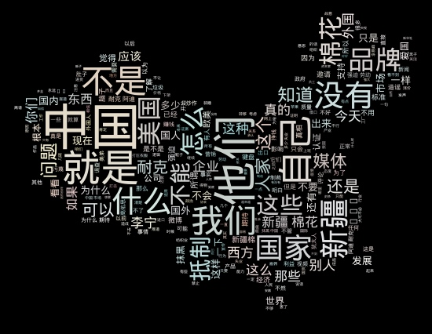

# 分析了几万“新疆棉”的评论数据
最近一段时间“新疆棉”的话题引起的很多关注，H&M、耐克、阿迪达斯等企业相继被抵制，原因大家比我更清楚。看到网上很多激动且爱国的言论，本着用数据说话的原则，笔者爬取了微博上有关“新疆棉”的评论数据，大约4.6万条。重点分析评论内容和情绪，以及谈论了哪些话题。

## 分析思路
本文主要分以下几个步骤来分析这些数据：
1. 清洗掉多余的换行符和空格，并且对评论“@用户名”进行剔除；
2. 对清洗后的数据进行分词，并统计词频（剔除干扰词的影响），制作词云；
3. 对清洗数据进行情感分类，得出情感分类统计图；
4. 找出积极和消极、以及中立的言论；
5. 得出结论。

## 分析数据
基于4.6万微博评论数据（部分数据如下：）
```
这些新华社的评论员跟记者就的西方的卧底吧？!
确实，无冕之王媒体谁来约束？
回复@冰山仙客:看得真切，一语中的。
回复@湘微笑8:谢谢朋友！李宁产品就是好，只是从前有些人不太关注，特别是上年纪的人。产品好会有商家去炒货，不过市场行为！市场炒洋货他们怎么不发声？
回复@珠山人:很多慕洋思想者买的不是鞋子，是吊牌，是所谓的面子
放着耐克不批，批椰树。
媒体成事不足，败事有余，缺乏党性、人民性、战斗力。
管好房价就行了，你我这种人会去炒鞋子？
```
清洗之后进行分词，分词工具采用结巴分词模块。制作词云图如下：


其中可以看到权重较大的词分别是“新疆”、“棉花”、“力挺”、“中国”、“支持”、“国货”等这些词，说明广大网友基本都是积极支持新疆棉花；而对于“国货”“当自强”这类词提及较多，说明当前网友对于国产的品质表现出了担忧，希望国货能够进一步提升质量；同时也大量提到了“耐克”、“阿迪”等关键词。

进一步对评论进行情感分类，得出每条评论的正向情绪的统计图如下，情感分析采用百度的senta，算法使用Bi-LSTM。

1表示情绪是正面的概率，0表示负面的概率。从上图可以看出网友对此次事件是非常的气愤，情感的分布主要在两边，其中大部分都是消极情绪，其次是积极情绪，也有部分是中立情绪。

消极情绪的评论通过去重复数据，给出部分样本：
```
'美国就是看你中国这么随和才好欺负你的'
'你是跪久了起不来了，键盘侠了吗？说话尖酸刻薄。'
'用苹果手机和平板的人，就不要在这里网上爱国了'
'某些所谓的国际媒体闭眼黑'
'霍真的该整顿下了'
'新疆棉花质量好价格高，hm这种地摊货不配！
'外媒标题:犹太人被迫在中国新疆采棉花'
'老美这是狗急跳墙了嘛，注定不会有好果子吃的！！！国货崛起！！！！！！'
```
消极评论的词云图：

消极的评论中核心词也是“中国”和“新疆”、“自己”，不过出现了权重比较大的“他们”、“美国”、“耐克”、“抵制”，“媒体”等词。

积极情绪评论数据去重以后，给出部分样本：
```
'我是中国人。我支持新疆棉花[加油]'
'一直在得物购买非限量版，确实比旗舰店便宜很多'
'新疆棉花就是坠好的！'
'加油中国'
'国货加油哦'
'支持祖国支持新疆'
中国李宁的款式确实挺好看的，属于潮牌，不比耐克阿迪差，质量也不错～安踏也还行',
'加油中国',
'国货加油哦',
'我是不买了，支持国产',
```
积极评论的词云图：

积极情绪大多都是表示支持国货，支持国产。从积极评论的词云中可以看到，权重最大的是“新疆”，“支持”、“中国”、“加油”等字样。

## 结论
笔者通过分析4.6万的微博评论数据，发现广大网友对于此次“新疆棉”事件表现出极大的负面情绪，负面评论中大多是抵制美国，抵制耐克等主要观点。而积极评论中主要体现在对于新疆棉的支持，以及对国产品牌的支持等观点。

当然支持国产没有问题，但不能在支持国产的同时，对于别的网友实行网络暴力，甚至是人身攻击。负面评论中存在大量的攻击性语言，我们的语言创造出来，是用来沟通交流的，而不是骂人的或者仅仅发泄个人情绪，希望多一些包容，少一些对抗。